---
output:
  pdf_document: default
  html_document: default
---
# Bayesian Inference

## Simple Examples
We start this chapter with two basic examples that only have one data point. They illustrate the point of prior distributions and motivate our discussions on conjugate priors later.  

::: {.example}
Suppose we have a model $Y \mid \theta \sim N(\theta, 1)$ and we want to derive the posterior distribution $\pi(\theta\mid y)$. By Bayes' theorem, 
$$
\pi(\theta \mid y) \propto \pi(y \mid \theta) \pi(\theta).
$$
We know the form of $\pi(y \mid \theta) = \frac{1}{\sqrt{2\pi}}e^{-\frac{1}{2}(y - \theta)^2}$, but how should we describe our prior beliefs about $\theta$? Here are three options:

1. We can be very vague about $\theta$ -- we genuinely don't know about its value. We assign a uniform prior distribution to $\theta$ that takes values between -1,000 and +1,000, i.e. $\theta \sim U[-1000, 1000]$. We can write explicitly its distribution as 
\[
	\pi(\theta) =  \begin{cases} 
					\frac{1}{2000}& q \in [-1000, 1000] \\
					0 & \textrm{otherwise.}
				\end{cases}
\]
Up to proportionality/constant, we have $\pi(\theta) \propto 1$ for $\theta \in [-1000, 1000]$.

2. After thinking hard about the problem, or talking to an expert, we decide that the only thing we know about $\theta$ is that it can't be negative. We adjust our prior distribution from 1. to be $\theta \sim U[0, 1000]$. Up to proportionality $\pi(\theta) \propto 1$ for $\theta \in [0, 1000]$.

3. We decide to talk to a series of experts about $\theta$ asking for their views on likely values of $\theta$. Averaging the experts opinions gives $\theta \sim N(3, 0.7^2)$. This is a method known as prior elicitation. 

We now go and observe some data. After a lot of time and effort, we collect one data point: $y = 0$.

Now we have all the ingredients to construct the posterior distribution. We multiply the likelihood function evaluated at $y = 0$ by each of the three prior distributions. This gives us the posterior distributions. These are

1. For the first uniform prior distribution, the posterior distribution is $\pi(\theta \mid {y}) \propto \exp\left(-\frac{1}{2}\theta^2\right)$ for $\theta \in [-1000, 1000]$.  
2. For the second uniform prior distribution, the posterior distribution is $\pi(\theta \mid {y}) \propto \exp\left(-\frac{1}{2}\theta^2\right)$ for $\theta \in [0, 1000]$. 
3. For the normal prior distribution,  the posterior distribution is $\pi(\theta \mid {y}) \propto \exp\left(-\frac{1}{2}\theta^2\right)\exp\left(-\frac{1}{2}\left(\frac{\theta - 3}{0.7}\right)^2\right)$. Combining like terms, we have $\pi(\theta \mid {y}) \propto \exp\left(-\frac{1}{2}\left(\frac{1.49\theta^2 - 6\theta}{0.7^2}\right)\right)$ for $\theta \in \mathbb{R}$. By further completing the square and comparing to the normal density, one can see the posterior distribution is actually normal with mean $300/149 \approx 2$ and variance $49/149 \approx 0.33$.


```r
#The likelihood function is the normal PDF
#To illustrate this, we evaluate this from [-5, 5].
x <- seq(-5, 5, 0.01)
likelihood <- dnorm(x, mean = 0, sd = 1)

#The first prior distribution we try is a 
#uniform [-1000, 1000] distribution. This is a 
#vague prior distribution. 
uniform.prior <- rep(1, length(x))
posterior1 <- likelihood*uniform.prior


#The second prior distribution we try is a uniform 
#[0, 1000] distribution, i.e. theta is non-negative. 
step.prior <- ifelse(x >= 0, 1, 0)
posterior2 <- likelihood*step.prior


#The third prior distribution we try is a
#specific normal prior distribution. It
#has mean 3 and variance 0.7.
normal.prior <- dnorm(x, mean = 3, sd = 0.7)
posterior3 <- likelihood*normal.prior

#Now we plot the likelihoods, prior and posterior distributions. 
#Each row corresponds to a different prior distribution. Each
#column corresponds to a part in Bayes' theorem. 
par(mfrow = c(3, 3))
plot(x, likelihood, type = 'l', xlab = "", ylab = "", yaxt = "n", main = "Likelihood")
plot(x, uniform.prior, type = 'l', yaxt = "n", xlab = "", ylab = "", main = "Prior")
plot(x, posterior1, type = 'l', yaxt = "n", xlab = "", ylab = "", main = "Posterior")
plot(x, likelihood, type = 'l', xlab = "", ylab = "", yaxt = "n")
plot(x, step.prior, type = 'l', yaxt = "n", xlab = "", ylab = "")
plot(x, posterior2, type = 'l', yaxt = "n", xlab = "", ylab = "")
plot(x, likelihood, type = 'l', xlab = "", ylab = "", yaxt = "n")
plot(x, normal.prior, type = 'l', yaxt = "n", xlab = "", ylab = "")
plot(x, posterior3, type = 'l', yaxt = "n", xlab = "", ylab = "")
```

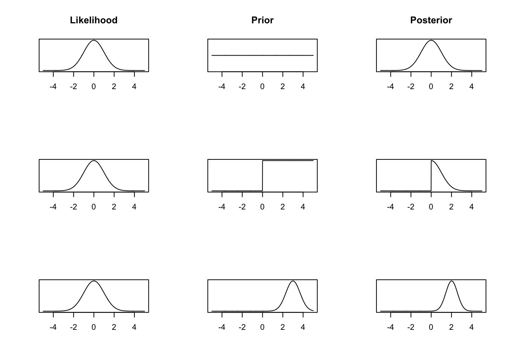

1. The posterior distribution is proportional to the likelihood function. The posterior distribution closely matches frequentist inference. Both the MLE and posterior mean are 0. 

2. We get a lopsided posterior distribution, that is proportional to the likelihood function for positive values of $\theta$, but is 0 for negative values of $\theta$. 

3. We get a normal posterior distribution.  
:::

::: {.example #binom name="Binomial likelihood"}
A social media company wants to determine how many of its users are bots. A software engineer collects a random sample of 200 accounts and finds that three are bots. Assuming that any two accounts being a bot are independent of one another, she decides to model the outcome as $Y\mid \theta \sim \text{Bin}(200,\theta)$, and the observation is $y = 3$.

By Bayes' theorem, we have
$$
\pi(\theta \mid {y}) \propto \pi({y}\mid \theta) \pi(\theta).
$$

**Likelihood function** $\pi({y}\mid \theta)$. The Binomial likelihood function is given by
$$
\pi({y}\mid \theta) = \begin{pmatrix} 200 \\ 3 \end{pmatrix} \theta^3(1-\theta)^{197} \propto \theta^3(1-\theta)^{197}.
$$

**Prior distribution** $\pi(\theta)$. We now need to describe our prior beliefs about $\theta$. We have no reason to suggest $\theta$ takes any specific value, so we use a uniform prior distribution $\theta \sim U[0, 1]$, where $\pi(\theta) = 1$ for $\theta \in [0, 1]$. 

**Posterior distribution** $\pi(\theta \mid {y})$. We can now derive the posterior distribution up to proportionality
$$
\pi(\theta \mid {y}) \propto \theta^3(1-\theta)^{197}, \qquad \theta \in (0,1). 
$$
This functional dependence on $\theta$ identifies that the posterior distribution $\pi(\theta \mid {y})$ is a Beta distribution. Recall that the density function for the Beta distribution with shape parameters $\alpha$ and $\beta$ is
$$
\pi(x \mid \alpha, \beta) = \frac{1}{B(\alpha,\beta)}x^{\alpha - 1}(1-x)^{\beta - 1}, \qquad x\in(0,1). 
$$
Therefore, the posterior distribution is $\textrm{Beta}(4, 198)$. We also note that the uniform distribution on $[0,1]$, $U[0, 1]$, is a special case of Beta distribution with $\alpha = 1$ and $\beta = 1$.
:::

## Reporting Conclusions from Bayesian Inference

Posterior distribution $\pi(\theta \mid y)$ summaries all the information and uncertainty regarding the parameter $\theta$, given the data $y$, e.g.\ it can be used to compute $\pi( \theta \in A \mid y) = \int_{A} \pi(\theta \mid y) d\theta$ for any given set $A$, although computing this exactly also requires knowing $\pi(\theta\mid y)$ exactly. However, we are often also interesting in summarizing the distribution in some way and make our result easy to interpret. 

We could consider reporting point estimates of $\theta$. To give a specific estimate of $\theta$, we may use **posterior mean**, i.e. $\mathbb{E}(\theta\mid y) = \int \theta \, \pi(\theta \mid y) d\theta$, which also requires knowing $\pi(\theta\mid y)$ exactly in order to compute it exactly, or **posterior mode**, defined as 
\[
\hat{\theta}(y) := \argmax_{\theta \in \Theta} \pi(\theta\mid y) = \argmax_{\theta \in \Theta} \pi( y \mid \theta) \pi(\theta).
\]
The posterior mode is also known as **maximum a posteriori (MAP)** estimate. If $\pi(\theta) \propto 1$, then $\hat{\theta}_{\text{MAP}}(y) = \hat{\theta}_{\text{MLE}}(y)= \argmax_{\theta \in \Theta} \pi( y \mid \theta).$ Another ideal property is that finding MAP does not require knowing the posterior exactly. 

In the previous example, the posterior distribution is $\textrm{Beta}(4, 198)$. The posterior mean is $\frac{4}{198+4} = \frac{2}{101}$ and the posterior mode is $\frac{4-1}{4+198-2} = \frac{3}{200}$. 

In addition to point estimates, it is important to share the uncertainty about $\theta$. In the frequentist framework, this achieved via confidence intervals. The Bayesian analogue is called credible intervals. 

::: {.definition}
An interval $[l,u]$ is called a **credible interval** at level $1-\alpha$, $\alpha \in (0,1)$, for a random variable $\theta \in \R$ if 
\[
\pi(l \leq \theta \leq u\mid y) =  \int_{l}^u \pi(\theta\mid y) = 1-\alpha.
\]
Although this definition does not identify a unique crediable interval at level $1-\alpha$, the most common choice is choosing $l$ and $u$ such that 
$\pi(\theta < l\mid y) = \pi(\theta >u \mid y) = \alpha/2$. This way of specifying creaiable intervals is known as equal-tailed intervals. 

Note that we can interpret a credible interval at level $1-\alpha$ as there is $100(1-\alpha)\%$ probability that $\theta$ belongs to that particular interval given the data. The parameter $\theta$ is random and the interval is fixed in the definition of credible intervals. This is, in some sense, more intuitive than the interpretation of CIs, which relies on repeated sampling.  

:::

::: {.example}
The 95% credible interval for the Binomial example is given by

```r
cred.int.95 <- qbeta(c(0.025, 0.975), 4, 198)
round(cred.int.95, 3)
```

```
## [1] 0.005 0.043
```
This says that we believe there is a 95% chance that the probability of an account being a bot lies between 0.005 and 0.043. 
:::

## Conjugate Prior and Posterior Analysis

We have seen from the two examples discussed so far 

1. Normal Prior + Normal Likelihood $\longrightarrow$ Normal Posterior 
2. Uniform Prior (Beta$(1,1)$) + Binomial Likelihood $\longrightarrow$ Beta Posterior

Notice that in both cases, the prior and posterior distribution belong to the same family of distributions. In this case, we say the prior is conjugate with respect to the likelihood function. 

::: {.definition name="Conjugate Prior"}

For a given likelihood, $\pi(y \mid \theta)$, if the prior distribution $\pi(\theta)$ and the posterior distribution $\pi(\theta \mid {y})$ are in the same family of distributions, then $\pi(\theta)$ is a conjugate prior/ is conjugate with respect to $\pi(y \mid \theta)$. 
:::

::: {.example #exponential name="Exponential likelihood"}

Suppose $Y_1,\dotsc,Y_n\mid \lambda \overset{i.i.d.}{\sim} \mathrm{Exp}(\lambda)$, and consider a Gamma prior on the parameter $\lambda \sim \text{Gamma}(\alpha,\beta)$. Let $Y = (Y_1,\dotsc,Y_n).$ By Bayes' Theorem, we can derive the posterior distribution of $\theta \mid Y$ as
\begin{align*}
\pi(\lambda\mid y) \propto \pi(y\mid \lambda) \pi(\lambda) &= \prod_{i=1}^n\pi(y_i\mid \lambda)\pi(\lambda) \\
&= \lambda^n e^{-\lambda\sum_{i=1}^n y_i}\pi(\lambda) \\
& \propto \lambda^n  e^{-\lambda\sum_{i=1}^n y_i} \lambda^{\alpha-1}e^{-\beta \lambda}\\
& = \lambda^{\alpha+n-1} e^{-\lambda (\beta+\sum_{i=1}^ny_i)}.
\end{align*}

This means that the posterior distribution is Gamma$(\alpha+n, \beta+\sum_{i=1}^ny_i)$. Therefore, we conclude that Gamma distribution is a conjugate prior for Exponential likelihood.

Using basic properties of Gamma distribution, we can then obtain 
\[
\E(\lambda\mid y) = \frac{\alpha+n}{\beta+\sum_{i=1}^ny_i}.
\]
Note that the mean of the prior distribution is $\E(\lambda) = \alpha/\beta$ and the MLE for $\lambda$ is $\hat{\lambda}_{\text{MLE}} = \frac{n}{\sum_{i=1}^ny_i}$. We can interpret the posterior mean as a weighted average of prior mean and the MLE by noticing 
\[
\E(\lambda\mid y) = \frac{\beta}{\beta+\sum_{i=1}^ny_i} \cdot \frac{\alpha}{\beta} + \frac{\sum_{i=1}^ny_i}{\beta+\sum_{i=1}^ny_i} \cdot \frac{n}{\sum_{i=1}^ny_i}.
\]
If either $n$ is large, i.e.\ we have abundant data, or $\beta$ is small, i.e.\ we have a vague prior (vague in the sense $\mathrm{Var}(\lambda) = \alpha/\beta^2$ is large), the weight on MLE is close to $1$, and we would have  $\E(\lambda\mid y) \approx \hat{\lambda}_{\text{MLE}}$. On a slightly more technical level (don't worry if you are confused about this), it is not hard to show that $\E(\lambda\mid Y) - \hat{\lambda}_{\text{MLE}}(Y)$ converges in probability to $0$, under $Y_1, \dotsc,Y_n \overset{i.i.d}{\sim} \text{Exp}(\lambda)$. 

We discuss a **real data example** now, which also illustrates the effects of choosing different $\beta$ in the prior distribution. An insurance company wants to estimate the average time until a claim is made on a specific policy using Bayesian inference. The data $\boldsymbol{y} = \{14, 10,  6,  7, 13,  9, 12,  7,  9,  8\}$ are collected, where each entry represents the number of months until a claimed is made. 

**Likelihood function** The exponential distribution is a good way of modelling lifetimes or the length of time until an event happens. Therefore, the company decides to model the observed data as realizations from $\text{Exp}(\lambda)$, where $\lambda$ represents the number of claims per month. Assuming all the claims are independent, the likelihood function is given by
\begin{align*}
\pi(\boldsymbol{y} \mid \lambda) &= \prod_{i=1}^{10} \lambda e^{-\lambda y_i} \\
& = \lambda^{10}e^{-\lambda \sum_{i=1}^{10} y_i} \\
& = \lambda^{10} e^{-95\lambda}.
\end{align*}


**Prior distribution** $\pi(\lambda)$. As we are modelling a rate parameter, we know it must be positive. We decide to use an exponential prior distribution for $\lambda$, but leave the choice of the rate parameter up to the insurance professionals at the insurance company. The prior distribution is given by $\lambda \sim \textrm{Exp}(\beta),$ which is the same as $\lambda \sim \text{Gamma}(1, \beta)$. 

**Posterior distribution** Using the formula we obtained before, the posterior distribution is $\textrm{Gamma}(11, 95 + \beta)$. The posterior mean months until a claim is $\frac{11}{95 + \beta}$. 

We can see the effect of the choice of rate parameter $\beta$ in this mean. Small values of $\beta$ yield vague prior distribution, since $\text{Var}(\lambda) = 1/\beta^2$, which plays a minimal role in the posterior distribution. Large values of $\beta$ result in specific prior distributions that contribute a lot to the posterior distribution. The plots below show the prior and posterior distributions for $\beta = 0.01$, $\beta = 50$ and $\beta = 150$.


```r
plot.distributions <- function(gamma.prior){
  #evaluate at selected values of lambda
  lambda <- seq(0.001, 0.3, 0.001) 
  
  #evaluate prior density
  prior <- dexp(lambda, rate = gamma.prior)
  
  #evaluate posterior density
  posterior <- dgamma(lambda, shape = 11, rate = 95 + gamma.prior)
  
  
  #plot
  plot(lambda, posterior, type= 'l', 
       ylim = c(0, 50), xlab = expression(lambda), ylab = "density")
  lines(lambda, prior, lty = 2)
  legend('topright', lty = c(1, 2), legend = c("Posterior", "Prior"),  
         bty = "n")
}

plot.distributions(0.01)
```

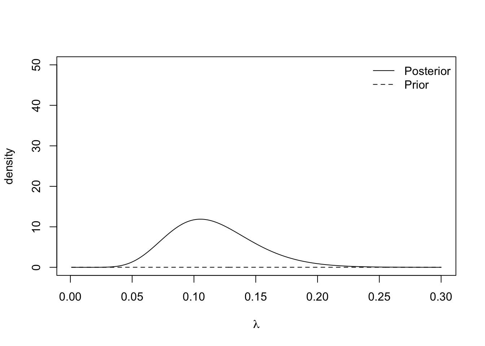

```r
plot.distributions(50)
```

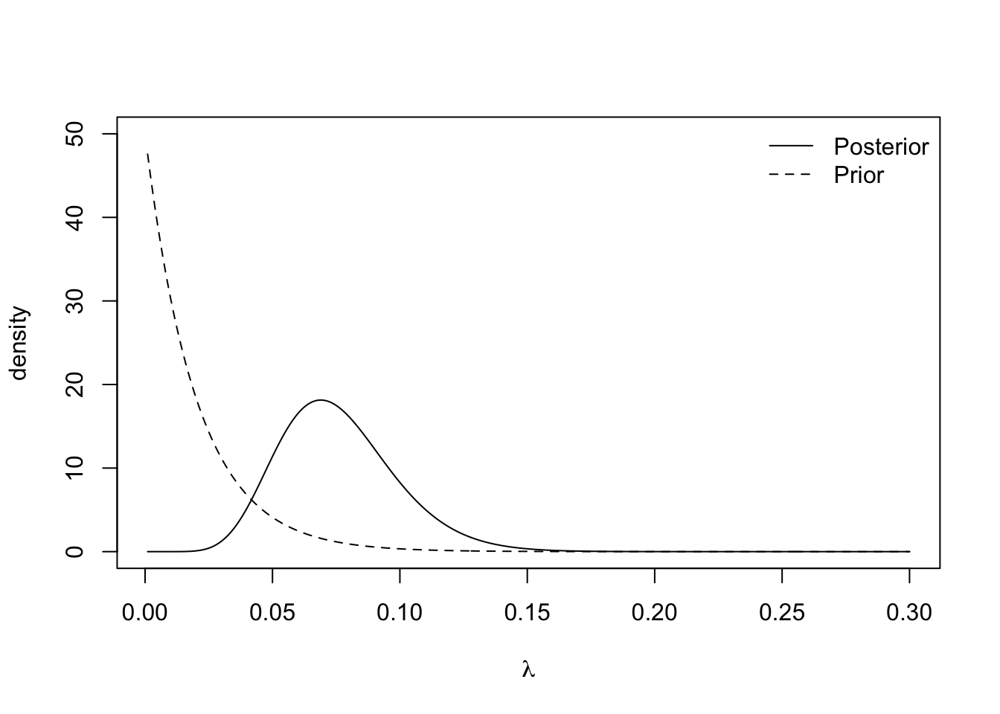

```r
plot.distributions(150)
```

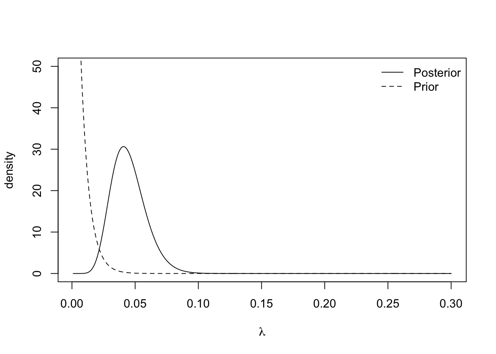

The insurance managers recommend that because this is a new premium, a vague prior distribution be used and $\gamma = 0.01$. The posterior mean is $\frac{11}{95.01} \approx 0.116$ and the 95% credible interval is

```r
round(qgamma(c(0.025, 0.975), 11, 95.01), 3)
```

```
## [1] 0.058 0.194
```
:::


::: {.example #normal name="Normal likelihood"}
Suppose $Y_1,\dotsc,Y_N \mid \mu \overset{i.i.d}{\sim} N(\mu, \sigma^2)$ and assume the value of $\sigma >0$ is known. Let $\boldsymbol{Y} = (Y_1,\dotsc,Y_n)$. We impose a Normal prior distribution on the unknown parameter $\mu \sim N(\mu_0, \sigma_0^2)$. By Bayes' theorem, the posterior distribution is 
$$
\pi(\mu \mid \boldsymbol{y}) \propto \pi(\boldsymbol{y} \mid \mu) \pi(\mu)
$$

**Likelihood function**. 
As the observations are independent, the likelihood function is given by the product of the $N$ normal density functions as follows,
\begin{align*}
\pi(\boldsymbol{y} \mid \mu) &= \prod_{i=1}^{N} \frac{1}{\sqrt{2\pi\sigma^2}}\exp\left\{-\frac{(y_i - \mu)^2}{2\sigma^2}\right\} \\
&= (2\pi\sigma^2)^{-\frac{N}{2}}\exp\left\{-\sum_{i=1}^{N}\frac{(y_i - \mu)^2}{2\sigma^2}\right\}.
\end{align*}

**Prior distribution** 
$$
\pi(\mu) = \frac{1}{\sqrt{2\pi\sigma_0^2}}\exp\left\{-\frac{1}{2\sigma_0^2}(\mu - \mu_0)^2\right\}.
$$


**Posterior distribution**. To derive the posterior distribution, up to proportionality, we multiply the prior distribution by the likelihood function. As the fractions out the front of both terms do not depend on $\mu$, we can ignore these. 
\begin{align*}
\pi(\mu \mid \boldsymbol{y}) &\propto\exp\left\{-\sum_{i=1}^{N}\frac{(y_i - \mu)^2}{2\sigma^2}\right\}  \exp\left\{-\frac{1}{2\sigma_0^2}(\mu - \mu_0)^2\right\} \\
& = \exp\left\{-\sum_{i=1}^{N}\frac{(y_i - \mu)^2}{2\sigma^2}-\frac{1}{2\sigma_0^2}(\mu - \mu_0)^2\right\} \\
& = \exp\left\{-\frac{\sum_{i=1}^{N}y_i^2}{2\sigma^2} + \frac{\mu\sum_{i=1}^{N}y_i}{\sigma^2} - \frac{N\mu^2}{2\sigma^2} - \frac{\mu^2}{2\sigma_0^2} + \frac{\mu\mu_0}{\sigma_0^2} - \frac{\mu_0^2}{2\sigma_0^2}\right\}.
\end{align*}

We can drop the first and last term as they do not depend on $\mu$. With some arranging, the equation becomes
$$
\pi(\mu \mid \boldsymbol{y}) \propto \exp\left\{-\mu^2\left(\frac{N}{2\sigma^2}  + \frac{1}{2\sigma_0^2}\right) + \mu\left(\frac{\sum_{i=1}^{N}y_i}{\sigma^2} + \frac{\mu_0}{\sigma_0^2} \right)  \right\}
$$
Defining $a =\left(\frac{\sum_{i=1}^{N}y_i}{\sigma^2} + \frac{\mu_0}{\sigma_0^2} \right)$ and $b^2 = \left(\frac{N}{\sigma^2}  + \frac{1}{\sigma_0^2}\right)^{-1} = \frac{\sigma^2\sigma_0^2}{N\sigma_0^2+\sigma^2}$ tidies this up and gives
$$
\pi(\mu \mid \boldsymbol{y}) \propto \exp\left\{-\frac{\mu^2}{2b^2} + \mu a \right\}.
$$
Our last step to turning this into a distribution is completing the square. Consider the exponent term, completing the square becomes
$$
-\frac{\mu^2}{2b^2} + \mu a = -\frac{1}{2b^2}\left(\mu - {a}{b^2} \right)^2 + \frac{a^2b^2}{2}.
$$
Therefore, the posterior distribution, up to proportionality, is given by 
$$
\pi(\mu \mid \boldsymbol{y}) \propto \exp\left\{-\frac{1}{2b^2}\left(\mu - ab^2 \right)^2\right\},
$$
and so the posterior distribution of $\mu \mid \boldsymbol{Y}$ is $N(ab^2, b^2)$, where the posterior mean is
\[
\mu_{\text{post}}:=ab^2 = \frac{\sigma_0^2\sum_{i=1}^N y_i+\mu_0\sigma^2}{N\sigma_0^2+\sigma^2} = \frac{N\sigma_0^2}{N\sigma_0^2 + \sigma^2} \cdot \frac{\sum_{i=1}^Ny_i}{N} + \frac{\sigma^2}{N\sigma_0^2 + \sigma^2} \cdot \mu_0
\]
and the posterior variance is $b^2$. Note that we have again that the posterior mean is a weighted average between the prior mean $\mu_0$ and the MLE for $\mu$, $\hat{\mu}_{\text{MLE}} = \overline{y} = \sum y_i/N$. If we have either abundant data (large $N$) or a vague prior (large $\sigma^2_0$), the weight on MLE is close to $1$ and we then have the posterior mean $\E(\mu\mid \boldsymbol{y}) \approx \sum y_i/N$.

To further interpret the weights, we write the posterior mean as 
\[
\mu_{\text{post}} = \frac{N/\sigma^2}{N/\sigma^2 + 1/\sigma_0^2} \cdot \frac{\sum_{i=1}^Ny_i}{N} + \frac{1/\sigma^2_0}{N/\sigma^2 + 1/\sigma_0^2} \cdot \mu_0
\]
Note that the **precision** of a univariate distribution is the reciprocal of its variance. Therefore, the prior distribution has precision $1/\sigma_0^2$ and the MLE $\hat{\mu}_{\text{MLE}} (\boldsymbol{Y})= \sum_{i=1}^NY_i/N \sim N(\mu,\sigma^2/N)$ has precision $N/\sigma^2$, if $Y_1\dotsc,Y_N \overset{i.i.d}\sim N(\mu,\sigma^2)$. Hence, we conclude that the posterior mean is a weighted average of the prior mean and the sample mean, with weights proportional to the precisions. Furthermore, with the notion of precision, it is very easy to remember the formula for posterior variance $b^2$ since it satisfies 
\[
\frac{1}{b^2} = \frac{N}{\sigma^2}+\frac{1}{\sigma_0^2},
\]
i.e.\ the posterior precision is the sum of the prior precision and MLE precision in this Normal-Normal example. 

Finally, let's consider constructing (equal-tailed) credible intervals at level $1-\alpha$, $\alpha < 1/2$. We need to find $l,u \in \R$ such that 
\[
\pi(\mu < l\mid \boldsymbol{y}) = \pi(\mu >u\mid \boldsymbol{y}) = \alpha/2
\]
so that $\pi(\mu \in [l,u] \mid \boldsymbol{y}) = 1-\alpha$. To do so, we have 
\[
\pi\Big(\frac{\mu - \mu_{\text{post}}}{b} > \frac{u-\mu_{\text{post}}}{b}\mid \boldsymbol{y} \Big) = \pi\Big(Z > \frac{u-\mu_{\text{post}}}{b}\Big) = \alpha/2,
\]
where $Z \sim N(0, 1)$. Therefore, we can choose 
\[
\frac{u-\mu_{\text{post}}}{b} = \Phi^{-1}(1-\alpha/2) \implies u = \mu_{\text{post}} + b \cdot \Phi^{-1}(1-\alpha/2)
\]
and similarly, choosing $l = \mu_{\text{post}} - b \cdot \Phi^{-1}(1-\alpha/2)$ guarantees that 
\[
\mu_{\text{post}} \pm b \cdot \Phi^{-1}(1-\alpha/2)
\]
is a $1-\alpha$ level credible interval for $\mu$. Recall that when $N$, the sample size, is large, $\mu_{\text{post}} \approx \hat{\mu}_{\text{MLE}}$ and $b^2 \approx \sigma^2/N$, this credible interval is approximately equal to the confidence interval obtained based on MLE, i.e. $\hat{\mu}_{\text{MLE}}\pm \frac{\sigma}{\sqrt{n}} \cdot \Phi^{-1}(1-\alpha/2)$. This phenomenon of numerical equivalence between credible interval and confidence interval based on MLE when $N$ is large holds more generally, as we will discuss at the end of this chapter. However, if $N$ is small, or there is a very strong (specific) prior belief, there could be a significant difference between credible intervals and confidence intervals.

We now explore the posterior distribution using R.  We simulate some data with $N = 30$, $\mu = 5$ and $\sigma^2 = 1$. Consider a very vague prior distribution $\mu \sim N(0,1000^2)$.

```r
#data
N <- 30
sigma <- 1
y <- rnorm(N, 5, sigma)
#MLE for mu
mean(y)
```

```
## [1] 4.860715
```

```r
#prior
sigma0 <- 1000
mu0     <- 0

#posterior
sigma1.sq <- (1/(sigma0^2)  + N/(sigma^2))^-1
mu1       <- sigma1.sq*(sum(y)/(sigma^2) + mu0/(sigma0^2))

c(mu1, sigma1.sq) #output mean and variance
```

```
## [1] 4.86071468 0.03333333
```

```r
#Create plot
mu <- seq(4, 6, 0.01)
posterior <- dnorm(mu, mean = mu1, sd = sqrt(sigma1.sq))
plot(mu, posterior, type ='l')
```

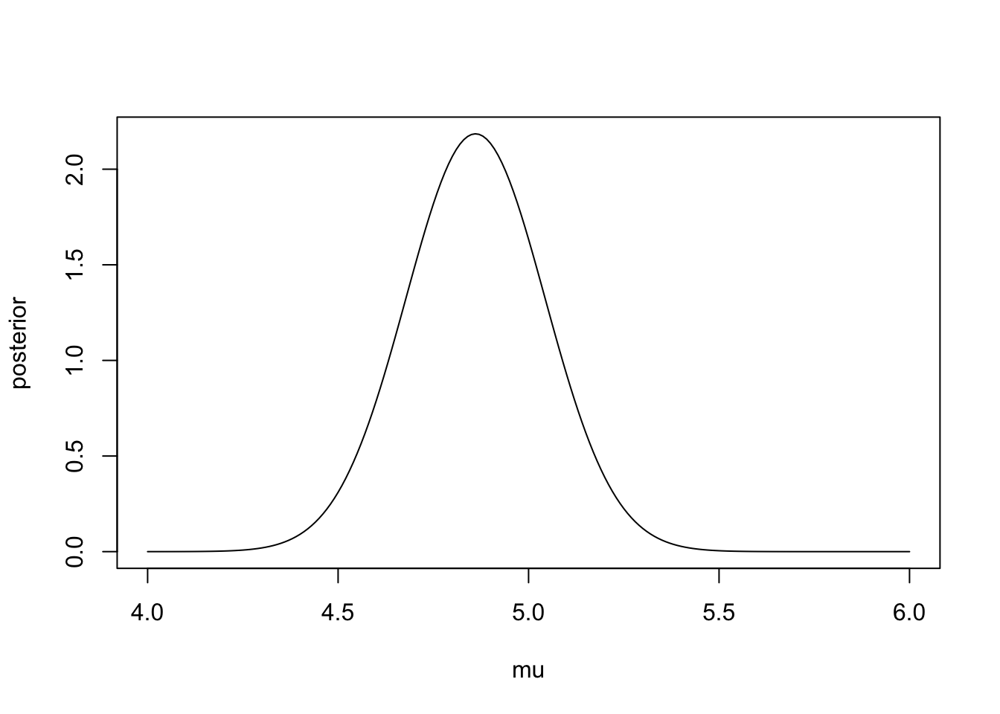

The 95% credible interval for the population's mean reaction time is

```r
qnorm(c(0.025, 0.975), mu1, sqrt(sigma1.sq))
```

```
## [1] 4.502876 5.218554
```
:::


## Prediction
In many cases, although we are interested in drawing inference for the model parameters, what we may also be interested in is predicting new values.


Suppose we observe some data $\boldsymbol{y}$ and model them using a statistical model parameterised by $\theta$, and assign a prior distribution $\pi(\theta)$ and hence derive the posterior distribution $\pi(\theta \mid \boldsymbol{y})$. The quantity we are interested in is some future observation $Z$, we would like to the derive the distribution of $Z$ given the observed data $\boldsymbol{y}$, which has density $\pi(z \mid \boldsymbol{y})$. This distribution, known as the **posterior predictive distribution** can be computed using the conditional version of law of total probability, i.e.
$$
\pi(z \mid \boldsymbol{y}) = \int \pi(z, \theta \mid \boldsymbol{y}) \,d\theta = \int \pi(z\mid \boldsymbol{y}, \theta)\pi(\theta \mid  \boldsymbol{y})\, d\theta.
$$
If we further assume $Z$ and $Y$ are conditionally independent given $\theta$, meaning that the future data is generated independently from the same model as the observed data $\boldsymbol{y}$, then $\pi(z\mid \boldsymbol{y}, \theta) = \pi(z\mid \theta)$, and therefore
\begin{equation}
\pi(z \mid \boldsymbol{y}) = \int \pi(z \mid \theta) \pi(\theta \mid \boldsymbol{y})\, d\theta. (\#eq:predictive)
\end{equation}

For questions in the problem sheets, summative assignments and the final exam, **you may assume** the posterior predictive distributions take the form in Equation \@ref(eq:predictive).


::: {.example}

Students have to submit coursework for a particular statistical module. However, each semester a number of students miss the deadline and hand in their coursework late. Last year, three out of 30 students handed their coursework in late. This year, the course has thirty students in. How many students can we expect to hand in their coursework late? 

We can model the number of students handing their coursework in late, denoted by $Y$, using a Binomial distribution, i.e. $Y \mid \theta \sim \textrm{Bin}(n, \theta)$ where $n$ is the number of students and $\theta$ is the probability of any particular student handing in their coursework late. As in Example \@ref(exm:binom), we assign a uniform prior distribution to $\theta \sim U[0, 1]$. Given the observed data, we can derive $\theta \mid \boldsymbol{y} \sim \text{Beta}(4, 28)$ (See problem sheets for the derivation of the general posterior distribution of Beta prior with Binomial likelihood).

Now we can derive the posterior predictive distribution of $Z$, the number of students who hand in late. We model $Z$ using a Binomial distribution, $Z \mid \theta \sim \textrm{Bin}(30, \theta)$. The distribution of $Z$ given the observed data is 

\begin{align*}
\pi(z \mid \boldsymbol{y}) &= \int_0^1 \pi(z \mid \theta) \pi(\theta \mid \boldsymbol{y})\, d\theta \\
& = \int_0^1 \begin{pmatrix} 30 \\ z \end{pmatrix} \theta^z (1-\theta)^{30 - z} \frac{1}{{B}(4,28)}\theta^{3}(1-\theta)^{27}\, d\theta \\
 & = \begin{pmatrix} 30 \\ z \end{pmatrix}\frac{1}{{B}(4,28)}\int_0^1 \theta^{z + 3}(1-\theta)^{57 - z}\, d\theta \\
\end{align*}
This integral is difficult to evaluate immediately. But by multiplying (and dividing outside the integral) by a constant, we can turn it into the density function of Beta$(4 + z, 58 - z)$, which integrates to 1. 

\begin{align*}
\pi(z \mid \boldsymbol{y})  & = \begin{pmatrix} 30 \\ z \end{pmatrix}\frac{B(z+4,58-z)}{{B}(4,28)}\int_0^1 \frac{1}{B(z+4,58-z)}\theta^{z + 3}(1-\theta)^{57 - z}\, d\theta \\ 
& = \begin{pmatrix} 30 \\ z \end{pmatrix} \frac{B(z+4,58-z)}{{B}(4,28)} \quad \textrm{for }  z \in \{0,1,...,30 \}.
\end{align*}

This is an example of Beta-Binomial distribution. This code implements the distribution using a property of the Beta function
\[
B(a,b) = \frac{\Gamma(a)\Gamma{(b)}}{\Gamma(a+b)}.
\]


```r
beta.binom.posterior.predictive.distribution <- function(z){
  
  
  numerator <- gamma(32)*gamma(z + 4)*gamma(58-z)
  denominator <- gamma(4)*gamma(28)*gamma(62)
  
  output <- choose(30, z)*numerator/denominator
  return(output)
  
}
```

We can check that our posterior predictive distribution is a valid probability mass function by checking that the probabilities sum to one.


```r
z <- 0:30
ppd <- beta.binom.posterior.predictive.distribution(z)
sum(ppd)
```

```
## [1] 1
```

```r
plot(z, ppd, xlab = "z", ylab = "Posterior predictive mass")
```

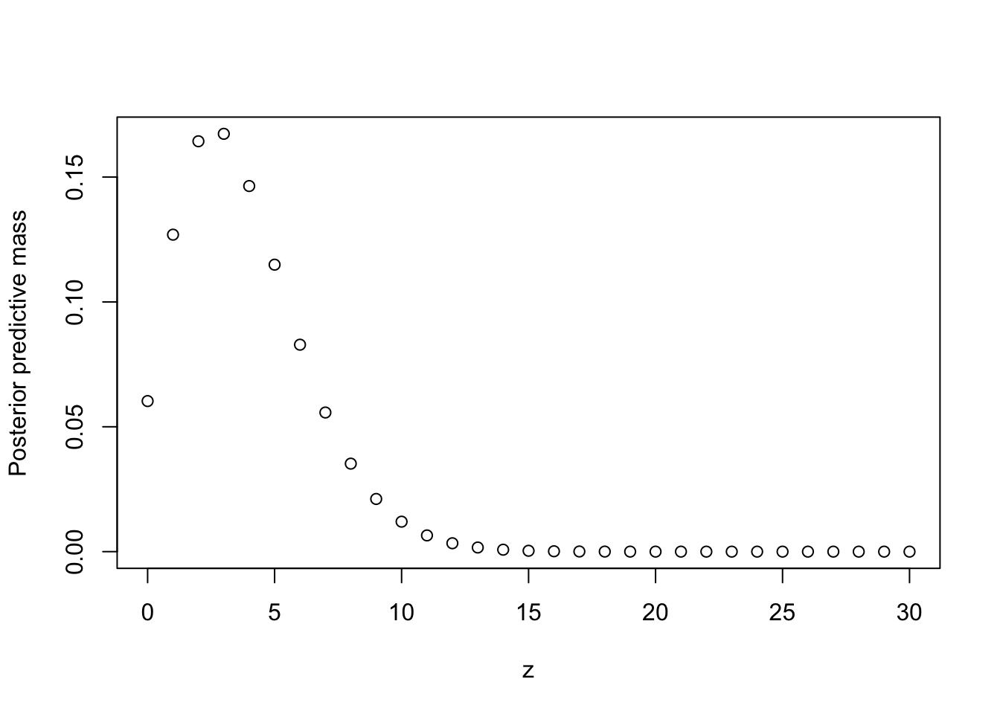

The expected number of students who hand in late is 3.75 and there's a 95.4% chance that up to 8 students will hand in late. 


```r
z%*%ppd #expectation
```

```
##      [,1]
## [1,] 3.75
```

```r
cbind(z, cumsum(ppd)) #CDF
```

```
##        z           
##  [1,]  0 0.06029453
##  [2,]  1 0.18723037
##  [3,]  2 0.35156696
##  [4,]  3 0.51889148
##  [5,]  4 0.66530044
##  [6,]  5 0.78021765
##  [7,]  6 0.86309065
##  [8,]  7 0.91880359
##  [9,]  8 0.95404202
## [10,]  9 0.97513714
## [11,] 10 0.98713498
## [12,] 11 0.99363285
## [13,] 12 0.99698773
## [14,] 13 0.99863936
## [15,] 14 0.99941423
## [16,] 15 0.99976022
## [17,] 16 0.99990696
## [18,] 17 0.99996591
## [19,] 18 0.99998826
## [20,] 19 0.99999622
## [21,] 20 0.99999887
## [22,] 21 0.99999969
## [23,] 22 0.99999992
## [24,] 23 0.99999998
## [25,] 24 1.00000000
## [26,] 25 1.00000000
## [27,] 26 1.00000000
## [28,] 27 1.00000000
## [29,] 28 1.00000000
## [30,] 29 1.00000000
## [31,] 30 1.00000000
```
:::

::: {.example name="Bayesian Linear Model"}
We consider performing Bayesian inference and prediction for the linear model in this example. For $i = 1,\dotsc,n$, let $(x_i, Y_i) \in \mathbb{R}^{p+1}$ be generated from
\[
Y_i = x_i^{\top}\beta + \varepsilon_i, \quad \varepsilon_i \overset{i.i.d}{\sim} N(0, \sigma^2),
\]
where $x_i = (x_{i1}, \dotsc, x_{ip})^{\top}$ is the covariate for the $i$-th individual, and $\beta = (\beta_1, \dotsc, \beta_{p})^{\top}$ is the $p$-dimensional regression parameter. The notation $\top$ stands for transpose of a vector and it makes both $x_i$ and $\beta$ column vectors. We will assume the covariates $x_i$'s are fixed and the value of $\sigma^2$ is known. A more compact way of writing the linear model is 
\[
Y = X\beta + \varepsilon, 
\]
where 
\begin{align*}
Y = \begin{pmatrix}
Y_1 \\
Y_2 \\
\vdots \\
Y_n
\end{pmatrix}, \quad X = \begin{pmatrix}
 x_{11} & x_{12} & \cdots & x_{1p} \\
 x_{21} & x_{22} & \cdots & x_{2p} \\
\vdots & \vdots & \ddots & \vdots  \\
 x_{n1} & x_{n2} & \cdots & x_{np}
\end{pmatrix}, 

\quad 

\varepsilon = 
\begin{pmatrix}
\varepsilon_1 \\
\varepsilon_2 \\
\vdots \\
\varepsilon_n
\end{pmatrix} \sim N(0, \sigma^2 I_{n \times n}).
\end{align*}

We are interested in two tasks: 

1. Find the posterior distribution $\pi(\beta\mid y, X, \sigma ) = \pi(\beta\mid y)$, which is a multivariate distribution on $\R^p$. Note that we can remove $X,\sigma$ from conditioning since they are assumed to deterministic and hence indepdenet of any random variables. 

2. Consider a future observation $(x',Y')$ such that $Y'  x'^{\top}\beta+\varepsilon, \varepsilon \sim N(0,\sigma^2)$. Again, assume $x_i$ and $\sigma$ are known. Find the posterior predictive distribution $\pi(y' \mid y, X, x', \sigma) = \pi(y' \mid y, x')$. 

For the first task, we consider a Normal prior distribution on $\beta$, $\beta \sim N(0, c^2 I_{p \times p})$. Note that $Y\mid \beta \sim N(X\beta, \sigma^2I_{n \times n})$, so this is again an example with normal prior and normal likelihood and it is reasonable to believe (hopefully) that the posterior distribution is also normal. At a high level, deriving this posterior requires the same procedure (e.g.\ completing the square) as in Example \@ref(exm:normal). However, in this multivariate setting, the calculation involves matrix multiplication and can be a bit daunting. Luckily, we can apply a general formula, known as the Bayes rule for Gaussians; see Section 3.3.1 in the book "Probabilistic machine learning: an introduction" by Kevin Murphy for more details. The general formula implies that 
\[
\beta \mid Y \sim N({\mu}, \Sigma), \quad \mu = \Big(X^{\top}X+\frac{\sigma^2}{c^2}I\Big)^{-1}X^{\top}Y, \quad \Sigma = \Big(\frac{1}{\sigma^2}X^{\top}X + \frac{1}{c^2}I\Big)^{-1}.
\]
We point out here an interesting connection to ridge regression. Recall that the ordinary least square (OLS) estimator in the frequentist framework for $\beta$ is \[
\hat{\beta}_{\text{OLS}} = (X^{\top}X)^{-1}X^{\top}Y = \argmin_{\beta \in \R^p} \|Y-X\beta\|_2^2,
\]
and for the matrix $X^{\top}X$ to be invertible, it must hold $n > p$, i.e.\ the sample size must be larger than the dimension of the covariates. In what is known as the high-dimensional setting, i.e.\ $p > n$, OLS cannot be applied and we typically add a penalty term in the original optimisation problem. Ridge regression estimator is obtained by 
\[
\hat{\beta}_{\text{ridge}}^{\lambda} = \argmin_{\beta \in \R^p} \Big\{\|Y-X\beta\|_2^2 + \lambda \|\beta\|_2^2\Big\} = (X^{\top}X+\lambda I)^{-1}X^{\top}Y,
\]
where a penalty on the squared $\ell_2$ norm of the regression parameter $\beta$ is added to the objective function. Now, we observe that the posterior mean is actually equivalent to the ridge regression estimator $\hat{\beta}_{\text{ridge}}^{\lambda}$ with $\lambda = \sigma^2/c^2$.

To further understand why this happens, we note that since posterior distribution is symmetric, the posterior mean and the MAP estimate coincide. Therefore, we have 
\begin{align*}
\mu = \argmax_{\beta} \pi(Y \mid \beta) \pi(\beta) &= \argmax_{\beta}\Big\{ \log\pi(Y \mid \beta) + \log \pi(\beta) \Big\} \\ &= \argmin_{\beta} \Big\{\|Y-X\beta\|_2^2 + \frac{\sigma^2}{c^2}\|\beta\|_2^2\Big\},
\end{align*}
since $\pi(Y\mid \beta) \propto \exp(-\frac{\|Y-X\beta\|^2}{2\sigma^2})$ and $\pi(\beta) \propto \exp(-\frac{\|\beta\|^2}{2c^2})$ due to the fact that they both follow multivariate normal distributions.  


To find the posterior predictive distribution $\pi(y'\mid y, x')$, one can of course find it by computing 
\[
\pi(y'\mid y, x') = \int \pi(y'\mid \beta, x') \pi(\beta \mid y) d\beta.
\]
Since $\pi(y'\mid \beta, x')$ and $\pi(\beta \mid y)$ are both normally distributed, this integral can be computed and still yields a normal distribution for the posterior predictive distribution. However, a much simpler argument is to notice that $y' = x'^{\top}\beta+\varepsilon$, where $\varepsilon \sim N(0,\sigma^2)$ is independent of $\beta$. Since we have the posterior distribution $\beta \mid Y$ is a Normal distribution, the posterior predictive distribution just a linear combination of independent Normal distributions, which is also Normal with mean $\mu_{pred}$ and variance $\sigma^2_{pred}$
\[
\mu_{pred} = x_i'^{\top}\mu, \quad \sigma^2_{pred} = x_{i}'^{\top} \Sigma x_i'+\sigma^2.
\]
Example 11.7.3 on page 406 from the book "Probabilistic machine learning: an introduction" by Kevin Murphy illustrates a simple Bayesian linear regression example using simulation.  
:::

## Non-informative Prior Distibrutions
We have seen in a few examples how the choice of the prior distribution (and prior parameters) can impact posterior distributions and the resulting conclusions. As the choice of prior distribution is subjective, it is the main criticism of Bayesian inference. A possible way around this is to use a prior distribution that reflects a lack of information about $\theta$. 


Consider a very simple setting where $X\mid \theta \sim \text{Bern}(\theta)$ with $\pi(x\mid \theta) = \theta^x(1-\theta)^{1-x}$, for $\theta \in [0,1]$ and $x\in \{0,1\}$. It would appear that the only sensible choice of prior that reflects the lack of information about $\theta$ is $\theta \in U[0,1]$. However, such a uniform prior distribution can lead to unintended side effects. Consider a **reparametrisation** of the Bernoulli model using $\psi = \theta^2$, which leads to 
\[
\pi(x\mid \psi) = (\sqrt{\psi})^x(1-\sqrt{\psi})^{1-x}
\]
for $\psi \in [0,1]$ and $x\in \{0,1\}$. Now, the issue that arises is if we have uniform prior belief about $\theta$, then our prior belief about $\psi=\theta^2$ is not uniform. Specifically let $\psi = \theta^2$, which has density 
\[
\pi(\psi) = \pi(\theta(\psi))\Bigg|\frac{d\theta(\psi)}{d\psi}\Bigg| = \frac{1}{2\sqrt{\psi}},
\]
and it suggests that we believe $\psi$ (and hence $\theta$) is more likely to take values that are close to 0 than 1. Therefore, the use of uniform prior is not invariant to reparametrisations and it is to some extend logically flawed. 

Sir Harold Jeffreys argues that if there are two ways of parameterising a model, e.g. via $\theta$ and $\psi$, then the priors on these parameters should be equivalent. In other words, the prior distribution should be invariant under sensible transformations/reparametersation. 

::: {.definition name="Jeffreys invariant prior"}
Given $Y\mid \theta \sim \pi(y\mid \theta)$, Jefferys prior is
$$
\pi(\theta) \propto \sqrt{I_Y(\theta)},
$$
where $I_Y(\theta)$ is the Fisher information for $\theta$ defined as 
\[
I_Y(\theta) = \mathrm{Var} \left[ \frac{\partial}{\partial \theta} \log \pi(Y\mid \theta) \right] = -\mathbb{E} \left[ \frac{\partial^2}{\partial \theta^2} \log \pi(Y \mid \theta) \right], \qquad Y \sim \pi(y\mid\theta). 
\]
:::

::: {.theorem name="invariance"}
Given $Y\mid \theta \sim \pi(y\mid \theta)$, consider a reparametrisation of the model by $Y\mid \psi \sim \pi(y\mid \psi)$ with $\psi = h(\theta)$, for some smooth strictly monotonic function $h$ so that the inverse of $h$ exists and we can write $\theta = h^{-1}(\psi)$. Jeffreys prior is **invariant** to such reparametrisation in the sense that 
$$
\pi(\psi) = \pi(\theta) \left|\frac{d\theta}{d\psi}\right| \propto \sqrt{I_Y(\psi)}.
$$
:::

::: {.proof}
Note that by the usual change of variable (also see the problem sheet), we have 
$$
\pi(\psi) = \pi(\theta) \left|\frac{d\theta}{d\psi}\right|.
$$
Recall that $\theta$ should be understood as a function of $\psi$ in the above formula. We prove the claim by directly computing the Fisher information under the $\psi$-parameterisation.

\begin{align*}
I_Y(\psi) &= - \mathbb{E}\left(\frac{d^2\log \pi({Y} \mid \psi)}{d\psi^2}\right) \\
&= -\mathbb{E}\left(\frac{d}{d\psi} \left( \frac{d \log \pi(Y|\theta)}{d \theta} \frac{d\theta}{d\psi} \right) \right) \tag{chain rule}\\
&= -\mathbb{E}\left(\left(\frac{d^2 \log \pi(Y|\theta)}{d \psi d\theta}\right)\left( \frac{d\theta}{d\psi}\right) + \left(\frac{d \log \pi(Y|\theta)}{d \theta}\right) \left( \frac{d^2\theta}{d\psi^2}\right) \right)\tag{prod. rule} \\
&= -\mathbb{E}\left(\left(\frac{d^2 \log \pi(Y|\theta)}{d \theta^2 }\right)\left( \frac{d\theta}{d\psi}\right)^2 + \left(\frac{d \log \pi(Y|\theta)}{d \theta}\right) \left( \frac{d^2\theta}{d\psi^2}\right) \right)\tag{chain rule} \\
& = -\mathbb{E}\left(\left(\frac{d^2 \log \pi({Y} \mid \theta)}{d\theta^2}\left(\frac{d\theta}{d\psi}\right)^2\right)\right)   \\
& = I_Y({\theta})\left(\frac{d\theta}{d\psi}\right)^2, 
\end{align*}
where we use the fact that $\E(\frac{d \log \pi(Y|\theta)}{d \theta}) = 0$ in the penultimate step. 
Thus $\sqrt{I_Y(\psi)} = \sqrt{I_Y(\theta)} \left|\frac{d\theta}{d\psi}\right| 
\propto \pi(\theta) \left|\frac{d\theta}{d\psi}\right|$, which proves our claim.
:::


::: {.example}
In Example \@ref(exm:binom), we modelled the number of bot accounts on a social media website by $Y \mid \theta \sim \textrm{Bin}(n, \theta)$. To find Jeffreys prior distribution for $\theta$, we just need to derive the Fisher information $I_Y(\theta)$.  

\begin{align*}
&\pi(y \mid \theta) = \begin{pmatrix} n \\ y \end{pmatrix} \theta^y (1-\theta)^{n-y}\\ 
\implies &\log \pi(y \mid \theta) = \log \begin{pmatrix} n \\ y \end{pmatrix} + y \log\theta + (n-y)\log(1-\theta) \\
\implies &\frac{\partial \log \pi(y \mid \theta)}{\partial \theta} = \frac{y}{\theta} - \frac{n-y}{1-\theta} \\
\implies &\frac{\partial^2 \log \pi(y \mid \theta)}{\partial \theta^2} = -\frac{y}{\theta^2} + \frac{y-n}{(1-\theta)^2} \\
 \mathbb{E}\left(\frac{\partial^2 \log \pi(Y \mid \theta)}{\partial \theta^2}\right) &= -\frac{\mathbb{E}(Y)}{\theta^2} + \frac{\mathbb{E}(Y)-n}{(1-\theta)^2}\\ 
 & = -\frac{n\theta}{\theta^2} + \frac{n\theta-n}{(1-\theta)^2}\\ 
 & = -\frac{n}{\theta} - \frac{n}{1-\theta}\\
 & = -\frac{n}{\theta(1-\theta)} \\
\implies &I_Y(\theta) \propto \frac{1}{\theta(1-\theta)}.
\end{align*}

Hence Jeffreys prior is $\pi(\theta) \propto \theta^{-\frac{1}{2}}(1-\theta)^{-\frac{1}{2}}$. This functional dependency on $\theta$ shows that $\theta \sim \textrm{Beta}(\frac{1}{2}, \frac{1}{2})$. 
:::

::: {.example name="imporper prior"}
Consider $Y \mid \mu \sim N(\mu,\sigma^2)$ with $\sigma>0$ known and $\mu \in \R$ unknown. We leave it as an exercise to show that $I_Y(\mu) = 1/\sigma^2$ and hence the Jefferys invariant prior for $\mu$ is 
\[
\pi(\mu) \propto \frac{1}{\sigma} \propto 1. 
\]
This is because $1/\sigma$ does not depend on $\mu$ and hence it can be considered to be a constant. One thing that we notice is choosing $\pi(\mu) \propto 1$ for $\mu \in \R$ does not lead to a proper probability distribution for $\mu$, since $\int_{-\infty}^{\infty} \pi(\mu)d\mu = \infty$. 
:::

Generally speaking, we call a prior distribution on $\theta \in \Theta$ that $\int_{\Theta} \pi(\theta)d\theta = \infty$, an **improper** prior. Improper priors are commonly used in Bayesian modelling, as long as the posterior distribution is well-defined, and it often conveys the idea that we do not know much about the parameter $\theta$. 


## Frequentist analysis of Bayesian methods

A main difference between frequentist and Bayesian inference is that there is a true (deterministic) parameter $\theta^*$ that generates the data in the frequentist framework, whereas Bayesian believe $\theta \sim \pi(\theta)$ is random. Many research in Bayesian inference are computational and algorithmic in nature, e.g. how to sample from a posterior distribution, but one theoretical topic is to study the frequentist properties (e.g. unbiasedess, consistent) of some Bayesian estimators (e.g. posterior mean, MAP, credible intervals).  

Specifically, one could view Bayesian method as an algorithmic tool to derive estimators and analyse their performance under the assumption that the data are generated from a model with true parameter $\theta^*$. 

::: {.example}
Consider $X_1,\dotsc,X_n \mid \theta \overset{i.i.d}\sim N(\theta,1)$ with $\theta \sim N(0,1)$. Using the formula for posterior distribution that we derived in Example \@ref(exm:normal), $$\theta\mid X \sim N\Big(\frac{n}{n+1}\overline{X}_n,\;\frac{1}{n+1}\Big),$$ where $\overline{X}_n = \sum_{i=1}^nX_i/n$ is the sample average/MLE for $\mu$. Suppose we report the posterior mean $\frac{n}{n+1}\overline{X}_n$ and, in order to study its theoretical property, we consider the hypothetical setting 
$$X_1,\dotsc,X_n \overset{i.i.d}{\sim} N(\theta^*,1).$$
Under this setting, we have a true parameter $\theta^*$ and we can discuss the bias, variance and mean squared error of the estimator $\hat{\theta}_n := \frac{n}{n+1}\overline{X}_n$ with respect to $\theta^*$, e.g. 
\[
\text{Bias}(\hat{\theta}_n) = \E(\hat{\theta}_n) - \theta^* = -\frac{\theta^*}{n+1}, \quad \text{Var}(\hat{\theta}_n) = \frac{n}{(n+1)^2}.
\]
One can compare this to that of MLE $\overline{X}_n$, which has bias $0$ and variance $1/n$. We can also consider the difference between the posterior mean as an estimator and the MLE  
\[
\overline{X}_n - \hat{\theta}_n  = \frac{1}{n+1}\overline{X}_n,
\]
which convergences to $0$ in probability, since $\overline{X}_n$ converges to $\theta^*$ in probability and $1/(n+1)$ converges to $0$, as $n \rightarrow \infty$. 

Moreover, given that $\sqrt{n}(\overline{X}_n - \hat{\theta}_n)$ also converges to $0$ in probability (You don't need to be able to show this), and $\sqrt{n} (\overline{X}_n - \theta^*) \sim N(0, 1)$, it holds that 
\[
\sqrt{n} (\hat{\theta}_n - \theta^*) \overset{d}{\longrightarrow} N(0,1),
\]
by Slutsky's Theorem (non-examinable in this course). With this result, we can consider the **frequentist coverage** of a credible interval. Recall that the $1-\alpha$ level credible interval $C_n(X)$ that we obtained in Example \@ref(exm:normal) is 
\[
 \hat{\theta}_n \pm \frac{1}{\sqrt{n+1}}\Phi^{-1}(1-\alpha/2).
\]
By frequentist coverage, we mean computing 
\begin{align*}
&\PP_{X_1,\dotsc,X_n \overset{i.i.d}\sim N(\theta^*,1)}(\theta^* \in C_n(X)) \\ &
= \PP_{X_1,\dotsc,X_n \overset{i.i.d}\sim N(\theta^*,1)}\Big(\hat{\theta}_n - \frac{1}{\sqrt{n+1}}\Phi^{-1}(1-\alpha/2) \leq \theta^* \leq \hat{\theta}_n + \frac{1}{\sqrt{n+1}}\Phi^{-1}(1-\alpha/2)\Big)\\
& = \PP_{X_1,\dotsc,X_n \overset{i.i.d}\sim N(\theta^*,1)}\Big(|\hat{\theta}_n - \theta^*| \leq \frac{1}{\sqrt{n+1}}\Phi^{-1}(1-\alpha/2)\Big) \\
& = \PP_{X_1,\dotsc,X_n \overset{i.i.d}\sim N(\theta^*,1)}\left(\sqrt{\frac{n+1}{n}} \sqrt{n}|\hat{\theta}_n - \theta^*|\leq \Phi^{-1}(1-\alpha/2)\right) \\ &\overset{n \rightarrow \infty}\longrightarrow \PP_{Z\sim N(0,1)} \left(|Z| \leq \Phi^{-1}(1-\alpha/2)\right) = 1-\alpha,
\end{align*}
which shows the credible interval derived using Bayesian method is also a valid confidence interval for $\theta^*$ at level $1-\alpha$ if $X_1,\dotsc,X_n \overset{i.i.d}\sim N(\theta^*,1)$.
:::

::: {.theorem name="Bernstein-von-Mises"}
Let $X_1,\dotsc,X_n \overset{i.i.d}\sim P_{\theta^*}, \theta^*\in \Theta\subseteq \R$. Let $\hat{\phi}_n(\theta)$ denote the (random) density function of $N\Big(\hat{\theta}_{\mathrm{MLE}},(nI(\theta^*))^{-1}\Big)$. Under relatively mild regularity conditions including the prior distribution for $\theta$ is non-zero around the MLE $\hat{\theta}$, then
$$
\frac{1}{2}\int \Big|\pi(\theta \mid X) - \hat{\phi}_n(\theta)\Big|d\theta \; \overset{a.s.}\longrightarrow 0.
$$
as $n \rightarrow \infty$.
:::

Technical details of this theorem can be found in Chapter 10 of Asymptotic Statistics (2000) by A. W. van der Vaart.
The Berstein-von-Mises theorem says that as the number of data points approaches infinity $(n \rightarrow \infty)$, the posterior distribution is approximately normal 
\[
\theta\mid X \sim N\Big(\hat{\theta}_{\mathrm{MLE}},(nI(\theta^*))^{-1}\Big).
\]
In particular, when $\theta \in \R$, an approximate ($1-\alpha$) level credible interval can be constructed as 
\[
C_n(X) = \hat{\theta}_{\mathrm{MLE}} \pm \frac{1}{\sqrt{nI(\hat{\theta}_{\mathrm{MLE}})}}\Phi^{-1}(1-\alpha/2),
\]
which is the same as the confidence interval that one would obtain using asymptotic properties of the MLE, and hence also has the frequentist coverage $\PP(\theta^* \in C_n(X)) \rightarrow 1-\alpha$ as in the example we discussed above.

## Hierarchical Models
In many modelling problems, there will be multiple parameters each related to one another. These parameters may be directly related to the model, or they may be parameters we introduce through prior distributions. We can form a hierarchy of these parameters, from closest to further from the data, to construct our model.

::: {.example}
Let's consider Example \@ref(exm:exponential) again. We have some data $\boldsymbol{y} = (y_1,\dotsc,y_n)$ that are assumed to have been generated from an Exponential distribution with rate parameter $\lambda$. We place an Exponential prior distribution with rate $\gamma$ on $\lambda$ and the posterior distribution was $\lambda \mid \boldsymbol{y} \sim \textrm{Gamma}(n+1, \sum_{i=1}^ny_i + \gamma)$. 

In that example, we discussed how the choice of $\gamma$ can affect the posterior distribution and conclusions presented to the company. One option is to place a prior distribution on $\gamma$, known as a hyperprior distribution, and form a hierarchy as
\begin{align*}
Y_1,\dotsc,Y_n \mid \lambda &\overset{i.i.d.}\sim \hbox{Exp}(\lambda) & \textrm{(likelihood)} \\
\lambda \mid \gamma &\sim \hbox{Exp}(\gamma) & \textrm{(prior distribution)} \\
\gamma  &\sim \hbox{Exp}(\nu) & \textrm{(hyperprior distribution)}.  \\
\end{align*}
This hierarchy can be represented as $\gamma \rightarrow \lambda \rightarrow \{Y_i\}_{i=1,\dotsc,n}$. We can write the posterior distribution for $\lambda$ and $\gamma$ given the data $\boldsymbol{y} = (y_1,\dotsc,y_n)$ as
\begin{align*}
\pi(\lambda, \gamma \mid \boldsymbol{y}) \propto \pi(\lambda, \gamma, \boldsymbol{y}) \propto \pi(\boldsymbol{y} \mid \lambda)\pi(\lambda \mid \gamma)\pi(\gamma) = \lambda^{n}\gamma e^{-\lambda(\sum_{i=1}^n y_i + \gamma)} \nu e^{-\nu\gamma} \propto \lambda^{n}\gamma e^{-\lambda(\sum_{i=1}^n y_i + \gamma)} e^{-\nu\gamma}.
\end{align*}
This is a joint distribution of $\lambda$ and $\gamma$ on $\R^2$, more specifically on $(0,\infty) \times (0,\infty)$ since the rate parameters are positive. We can also use it to find two conditional density $\pi(\lambda \mid \boldsymbol{y}, \,\gamma)$ and $\pi(\gamma \mid \boldsymbol{y}, \,\lambda)$. Recall that 
\[
\pi(\lambda, \gamma \mid \boldsymbol{y}) = \pi(\lambda \mid \boldsymbol{y}, \,\gamma) \pi(\gamma \mid \boldsymbol{y}) = \pi(\gamma \mid \boldsymbol{y}, \,\lambda)\pi(\lambda \mid \boldsymbol{y}).
\]
Therefore, in order to find $\pi(\lambda \mid \boldsymbol{y}, \,\gamma)$, we just need to collect the terms in $\pi(\lambda, \gamma \mid \boldsymbol{y})$ that only depends on $\lambda$, i.e.\ 
\[
\pi(\lambda \mid \boldsymbol{y}, \,\gamma) \propto \lambda^{n} e^{-\lambda(\sum_{i=1}^n y_i + \gamma)},
\]
which is the density of $\text{Gamma}(n+1,\sum_{i=1}^n y_i + \gamma)$, the same as the posterior distribution. 

Similarly, collecting all the terms that depend on $\gamma$ from $\pi(\lambda, \gamma \mid \boldsymbol{y})$ , we obtain 
\[
\pi(\gamma \mid \boldsymbol{y}, \,\lambda) \propto \gamma e^{-(\lambda+\nu)\gamma},
\]
which is the density function of $\text{Gamma}(2,\lambda+\nu)$.
In the next chapter, we will look at how to sample from these distributions, but more importantly, these conditional densities play a crucial role in Gibbs sampling - a particular type of MCMC algorithm.
:::

## Lab

The aim of this lab is to work with some posterior distributions in cases when the prior distribution is or is not conjugate. Recall the definition of a conjugate prior distribution:

::: {.defintion}
If the prior distribution $\pi(\theta)$ has the same distributional family as the posterior distribution $\pi(\theta \mid \boldsymbol{y})$, then the prior distribution is a **conjugate prior distribution**. 
:::

Working with conjugate prior distributions often makes the analytical work much easier, as we can work with the posterior distribution. But sometimes, conjugate prior distributions may not be appropriate. This is where R can help, as we do not need a closed form to carry out computations.


::: {.example}
The total number of goals scored in 50 games of a low level football league is shown below.

```r
y <- c(2, 6, 2, 3, 4, 3, 4, 3, 1, 2, 3, 2, 6, 6, 2, 3, 5, 1, 2, 2, 4, 2, 5, 3,
       6, 4, 1, 2, 7, 8, 4, 3, 7, 3, 3, 5, 2, 6, 1, 3, 7, 4, 2, 6, 8, 8, 4, 5,
       7, 4)
hist(y, main = "", xlab = "Number of goals scored")
```

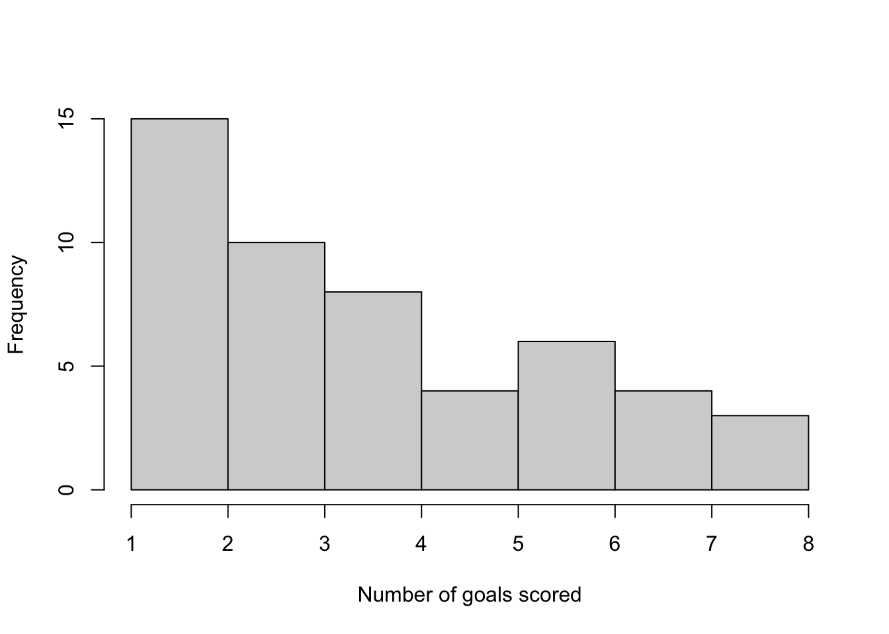

```r
mean(y)
```

```
## [1] 3.92
```
We can model the number of goals scored using a Poisson distribution 
$$
Y_1,\dotsc,Y_n \mid \lambda \overset{i.i.d}{\sim} \hbox{Poisson}(\lambda).
$$
By Bayes' theorem, the posterior distribution is given by
$$
\pi(\lambda \mid \boldsymbol{y}) \propto \pi(\boldsymbol{y} \mid \lambda)\pi(\lambda). 
$$
The likelihood function is given by
\begin{align*}
\pi(\boldsymbol{y} \mid \lambda) &= \prod_{i=1}^{50} \frac{e^{-\lambda}\lambda^{y_i}}{y_i!}\\
&= \frac{e^{-50\lambda}\lambda^{\sum y_i}}{\prod_{i=1}^{50} y_i!} 
\end{align*}


R has a set of inbuilt functions for working with the Poisson distribution so we can rely on those to write functions for the likelihood and loglikelihood. 


```r
lambda <- seq(0, 10, 0.01) #grid of lambda values
likelihood.function <- function(lambda, y) prod(dpois(y, lambda)) #compute likelihood
log.likelihood.function  <- function(lambda, y) sum(dpois(y, lambda, log = TRUE)) #compute loglikelihood
likelihood <- sapply(lambda,  likelihood.function, y) #evaluate at grid of points
log.likelihood <- sapply(lambda,  log.likelihood.function, y) #evaluate at grid of points

#Plot likelihood
plot(lambda, likelihood, 
     xlab = expression(lambda), ylab = "likelihood", type = 'l')
```

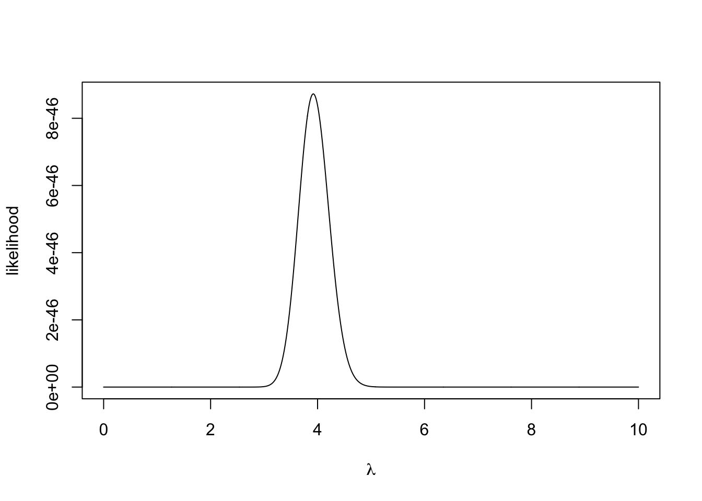

```r
plot(lambda, log.likelihood, 
     xlab = expression(lambda), ylab = "loglikelihood", type = 'l')
```

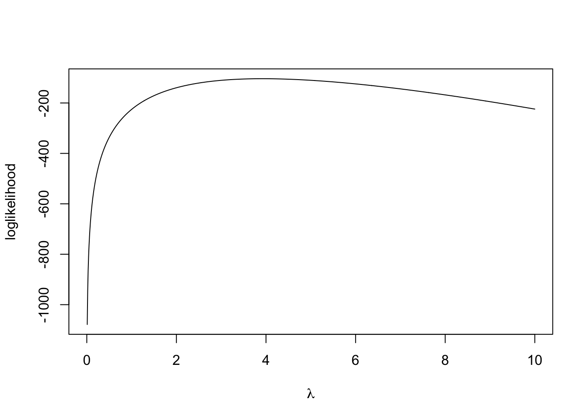

We sometimes work on the log scale because the numbers can be smaller that R can deal with. The denominator with the factorial can get very large very quickly. 

After speaking to football experts, we decide to place a normal prior distribution on $\lambda$ with mean 5 goals and standard deviation one goal, i.e.
$$
\lambda \sim N(5, 1).
$$
The prior distribution can be plotted by

```r
lambda   <- seq(0, 10, 0.01) #grid of lambda values
prior    <- dnorm(lambda, 5, 1)
log.prior <- dnorm(lambda, 5, 1, log = TRUE)
plot(lambda, prior, type = 'l', xlab = expression(lambda), ylab = "density")
```

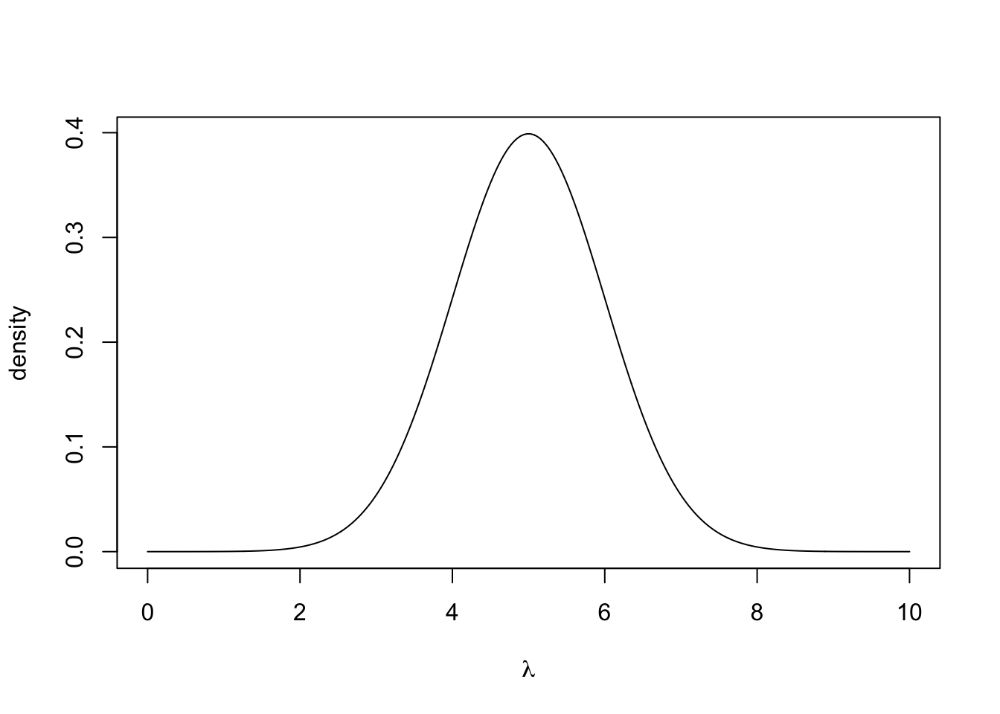

```r
plot(lambda, log.prior, type = 'l', 
     xlab = expression(lambda), ylab = "log density")
```

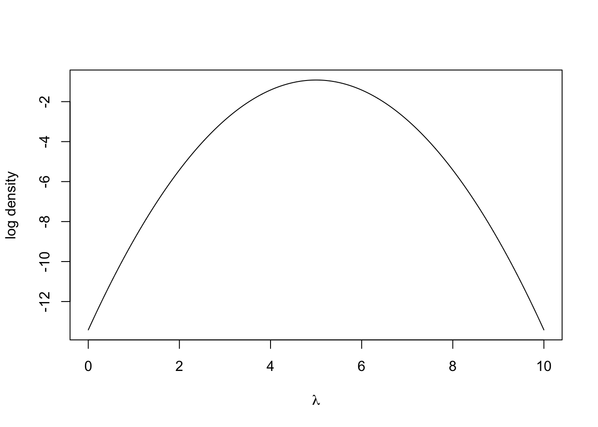

Writing the posterior distribution up to proportionality, we get
$$
\pi(\lambda \mid \boldsymbol{y}) \propto \exp\left(-50\lambda -\frac{1}{2}(\lambda - 5)^2\right)\lambda^{\sum y_i}.
$$
There is no closed form for this distribution and it is not that nice to work with. But with R, we can evaluate the posterior distribution at a grid of points with an approximation of the normalizing constant via the Trapezoidal rule. The Trapezoidal rule approximates the integral of a function $f(x)$ over an interval $[a,b]$ using a grid of points with spacing $h$
\[
\int_a^b f(x) dx \approx \frac{h}{2} \Big(f(x_0)+f(x_n)+2\sum_{i=1}^{n-1}f(x_i)\Big),
\]
where $x_0 = a$, $x_n = b$ and $x_i-x_{i-1} = h$ for $i = 1,\dotsc,n$.

```r
posterior <- prior*likelihood
integrating.factor <- 0.5*0.01*(posterior[1] + posterior[1001] + 2*sum(posterior[-c(1, 1001)])) #Using Trapezoidal rule
posterior <- posterior/integrating.factor #normalise
plot(lambda, posterior, type = 'l', xlab = expression(lambda), 
     ylab = "posterior density")
```

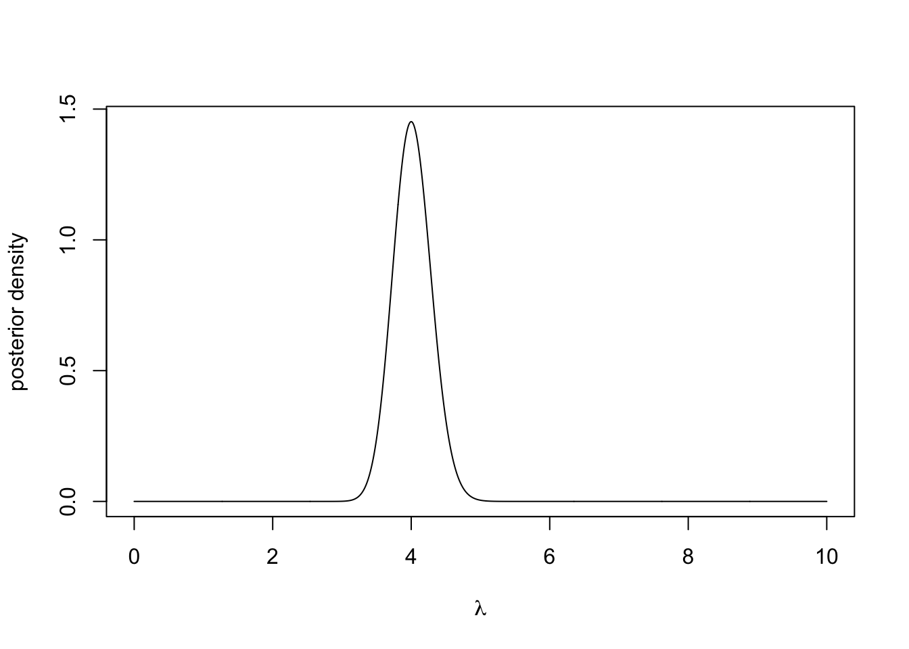

We can now visually inspect the posterior distribution and see that it has a strong peak around 4. One important statistic is the **maximum a posteriori estimation** or MAP estimate, this is the mode of the posterior distribution and it is a similar principle to the maximum likelihood estimate.

We can compute this using the command

```r
lambda[which.max(posterior)]
```

```
## [1] 4
```
which shows the MAP estimate is exactly 4. 
:::

::: {.exercise}
Adapt the code in the Example above to use an exponential prior distribution with rate 0.1. Analytically show that the posterior distribution is $\text{Gamma}(\sum_{i=1}^n y_i+1, n+0.1)$, where $n = 50$. Plot the posterior distribution for $\lambda \in [0,10]$ compare it to the approximation obtained using Trapezoidal rule. 
:::

::: {.exercise}
You are given that the data are exponentially distributed with rate $\lambda,$ i.e. $Y_1, \ldots, Y_N \mid \lambda \overset{i.i.d.}\sim \hbox{Exp}(\lambda)$. Your prior belief is that $\lambda \in (0, 1)$. Show that if the prior distribution is $\lambda \sim \hbox{Beta}(\alpha, \beta)$, then the posterior is 
\[
\pi(\lambda \mid \boldsymbol{y}) \propto \lambda^{N + \alpha - 1}(1-\lambda)^{\beta - 1}\exp{\Big(-\lambda\sum_{i=1}^Ny_i\Big)}, \quad \lambda \in (0,1),
\]
which does not have a simple closed form expression. 

Suppose that the data is given by 

```r
y <- c(1.95, 1.46, 4.81, 1.52, 4.24, 3.00, 0.46, 2.27, 1.76, 0.41)
```
:::
On a grid of points for $\lambda \in (0,1)$, evaluate the likelihood function, log-likelihood function, prior density (with $\alpha = \beta = 1$), and the posterior density (with Trapezoidal rule approximation). Plot the posterior distribution.  

::: {.exercise}
Suppose you have $X_1, ..., X_N \mid p \overset{i.i.d.}\sim \hbox{Binomial}(100, p)$. Using $p \sim \hbox{Beta}(\alpha, \beta)$ as the prior distribution, derive the posterior distribution and the posterior mean (Wikipedia is a helpful place for properties of distributions). 

1.  (Large data scenario) Fix $\alpha = 2$, $N = 150$ and $\sum_{i=1}^N x_i = 2971$. Plot the prior and posterior distributions on the same figure for different values of $\beta$. Plot the posterior mean against $\beta \in (0, 10)$. Plot the prior mean against the posterior mean for $\beta \in (0, 10)$. 

2.  (Small data scenario) Fix $\alpha = 2$, $N = 5$ and $\sum_{i=1}^N x_i = 101$. Plot the prior and posterior distributions on the same figure for different values of $\beta$. Plot the posterior mean against $\beta \in (0, 10)$. Plot the prior mean against the posterior mean for $\beta \in (0, 10)$. 
:::


