---
output:
  pdf_document: default
  html_document: default
---
# Sampling

## Uniform Random Numbers
What we won't be doing in this module is generating true uniform random numbers. This is incredibly difficult and usually requires lots of expensive hardware. This is because computers aren't good at being random, they require algorithmic instructions. True random number generation often uses physical methods, such as the radioactive decay of atoms, or atmospheric noise.

Throughout this module, we will be using R's built in random number generation. This is a pseudo random number generator that has excellent random properties, but will eventually repeat. A basic random number generation tool that we will repeatedly use in the module involves sampling from a uniform distribution on the unit interval, which can be done in R using

```r
runif(1, 0, 1)
```

```
## [1] 0.5993846
```


## Inverse Transform Sampling
Suppose we want to sample from a non-uniform one-dimensional distribution. The inverse transform theorem allows us to do this using the distribution's inverse function. 

::: {.definition}
The *generalised inverse* \(F^{-1}\colon [0,1] \to [-\infty,\infty]\) of a cumulative distribution function \(F\), is defined for all \(u \in [0, 1]\) by
\[
F^{-1}(u) = \inf\{x \in\mathbb{R} : F(x) \geq u\},
\]
where we use the convention \(\inf \varnothing = +\infty\).
:::
This definiton entails that $F^{-1}$ is left-continuous (while the *quantile function* \(q(u) = \inf\{x \in \mathbb{R}: F(x) > u\}\) is right-continuous). The reason for us to not demand a strict inequality for the generalised inverse is that our definition provides
\begin{equation}
(\#eq:pseudo)
\forall x \in \mathbb{R}, u \in [0,1]: u \leq F(x) \iff F^{-1}(u) \leq x
\end{equation}
by right-continuity of $F$. We also note that if \(F\) is bijective, its inverse function is identical to the generalised inverse on $(0,1]$.

::: {.theorem} 
Let $F\colon \mathbb{R} \rightarrow [0, 1]$ be a  distribution function, $U \sim U[0, 1]$ and $Y = F^{-1}(U)$. Then $Y$ has distribution function $F$.
:::

::: {.proof}
From \@ref(eq:pseudo) we obtain
\[
\mathbb{P}(Y \leq x) = \mathbb{P}(F^{-1}(U) \leq x) = \mathbb{P}(U \leq F(x)) = F(x),
\]
where the last equality follows from \(U \sim U[0, 1]\).
:::

This theorem says that if we have a random variable $U \sim U[0, 1]$ and we want to get $Y \sim F$, then we can use $F^{-1}(U)$. Viewing this theorem graphically can provide a much more intuitive understanding. 

::: {.example}
We would like to sample from an exponential distribution with rate $\lambda$, i.e. $Y ~ \sim \hbox{Exp}(\lambda)$. The density function is given by

$$
\pi(y \mid \lambda) = \begin{cases} 
      \lambda e^{-\lambda y} & y \geq 0 \\
    0  & \text{otherwise.}
   \end{cases}
$$

The distribution function for $y \geq 0$ is given by
\begin{align*}
F(y \mid \lambda) &= \int_0^y \lambda e^{-\lambda t}\,dt \\
& =  1 - e^{-\lambda y}.
\end{align*}
Finally, the inverse function on $(0,1)$ is given by
$$
F^{-1}(y \mid \lambda) = -\frac{1}{\lambda}\log(1-y).  
$$
Therefore, if $U \sim U[0, 1]$, then it follows that $-\frac{1}{\lambda}\log(1-U) \sim \hbox{Exp}(\lambda)$. 

The R code below generates a plot to show this (with $\lambda = 0.5$). We can plot the CDF for most one parameter distributions straightforwardly. We can think of this theorem as allowing us to sample a point on the y-axis and then computing the quantile this corresponds to. 


```r
set.seed(12345) # to reproduce
y <- seq(0, 10, 0.01) #Show on the interval [0, 5]
f <- 1 - exp(-0.5*y)    #Construct the cumulative density 
                        #function (CDF)
plot(y, f, type ='l', xlab = "y", ylab= "CDF")

#Sample u
u <- runif(1)

#Get the corresponding y value
f.inv <- -2*log(1-u)

#plot 
segments(x0 = 0, y0 = u, x1 = f.inv, y1 = u, lty = 2)
segments(x0 = f.inv, y0 = 0, x1 = f.inv, y1 = u, lty = 2)
text(x = f.inv, y = -0.01, expression(F[-1](U)), col = 4)
text(x = -.1, y = u, "U", col = 4)
```

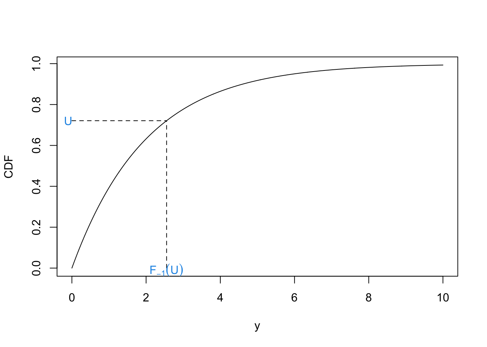
:::

::: {.example}
Suppose we want to generate samples from the Cauchy distribution with location 0 and scale 1. This has density function 
$$
\pi(x) = \frac{1}{\pi(1+x^2)}, \quad x \in \mathbb{R}.
$$
A plot of this function is shown below. 

```r
x <- seq(-5, 5, 0.01)
y <- 1/(pi*(1 + x^2))
plot(x, y, type = 'l')
```

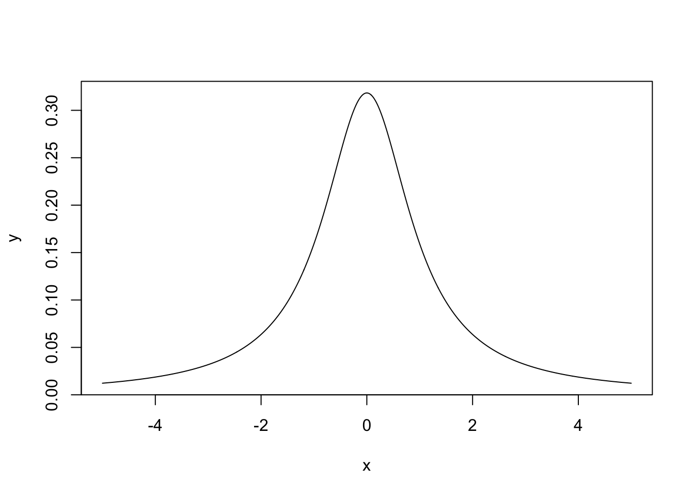
To use the inverse transform method, we first need to find the CDF:
$$
F(x) = \int_{-\infty}^x \frac{1}{\pi(1+t^2)}dt
$$
Letting $t = \tan \theta$, we can write $dt = \sec^2(\theta)d\theta$. The integral becomes
$$
F(x) = \int_{-\frac{\pi}{2}}^{\arctan(x)} \frac{\sec^2(\theta)}{\pi(1+\tan^2(\theta))} d\theta
$$
As $1 + \tan^2(\theta) = \sec^2(\theta)$, we can write the integral as
$$
F(x) = \int_{-\frac{\pi}{2}}^{\arctan(x)} \frac{1}{\pi}du\\
= \left[\frac{\theta}{\pi}\right]_{-\frac{\pi}{2}}^{\arctan(x)}\\
= \frac{\arctan(x)}{\pi} + \frac{1}{2}.
$$
The inverse of the distribution function is 
$$
F^{-1}(x) = \tan\left(\pi\left(x - \frac{1}{2}\right)\right).
$$
Hence, if $U \sim U[0, 1]$, then $\tan\left(\pi\left(U - \frac{1}{2}\right)\right) \sim \hbox{Cauchy}(0, 1)$.
:::

## Rejection Sampling
We now have a way of sampling realisations from distributions where we can analytically derive the inverse distribution function. We can use this to sample from more complex densities, or simple densities more efficiently. Rejection sampling works by sampling according to a density we can sample from and then rejecting or accepting that sample based on the density we're actually interested in. The plot below shows an example from this. We would like to generate a sample from the distribution with the curved density function, which is challenging. Instead, we find a distribution whose density function \(q\) multiplied by some $c \geq 1$ (call \(cq\) an *unnormalised density function*) bounds the one we wish to sample from. In this case we can use the uniform distribution. Once we have generated our sample from the uniform distribution, we choose to accept or reject it based on the distribution we are interested in. In this case we reject it.

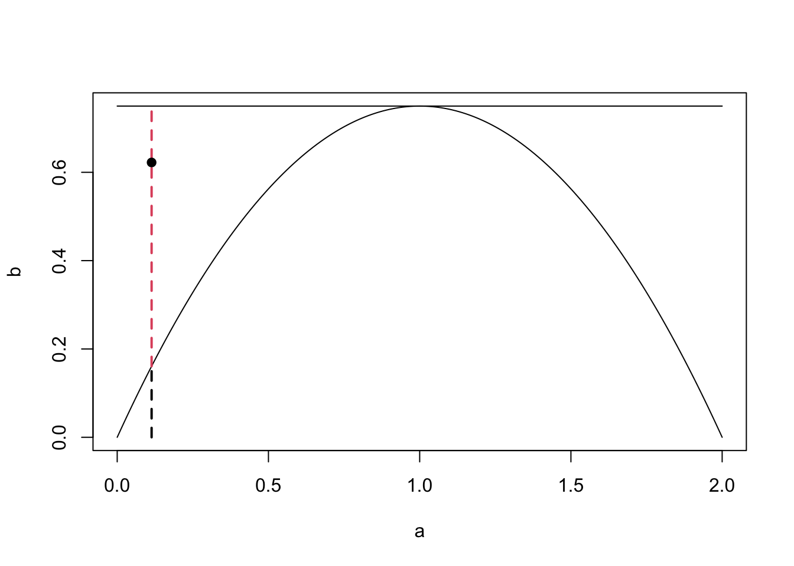


Suppose we want to sample from a density \(\pi\), but can only generate samples from a density \(q\). If there exists some constant \(c > 0\), such that \(\frac{\pi(y)}{q(y)} \leq c\) for all \(y\), then we can generate samples from \(\pi\) by the following:

1. Sample $y \sim q$

2. Sample independently $u \sim U[0, 1]$

3. Compute $k = \frac{\pi(y)}{cq(y)}$

4. Accept $y$ if $u \leq k$. Reject otherwise and repeat.


Upon rejection we then go back to step 1 until a sample is accepted. This says draw sample a point $y$ according to the density $q$. Draw a vertical line at $y$ from the $x$-axis to $cq(y)$. Sample uniformly on this line. If the uniformly random sample is below $q$, then accept it. Otherwise, reject it. 

::: {.theorem #accrej}
Let $Y \sim q$, $U \sim U[0,1]$ be independent of $Y$ and suppose that that for some $c \geq 1$ we have $\pi \leq cq$. Then, the acceptance probability of the rejection algorithm is given by 
\[\mathbb{P}\Big(U \leq \frac{\pi(Y)}{cq(Y)} \Big) = \frac{1}{c}, \]
and it holds that 
\[\mathbb{P}\Big(Y \in dy \mid U \leq \frac{\pi(Y)}{cq(Y)}\Big) =  \pi(y) \, dy.\]
:::

::: {.proof} 
Let $x \in \mathbb{R}$ be arbitrarily chosen. Since CDFs uniquely characterise distributions, for the second claim it is sufficient to show that 
\[\mathbb{P}\Big(Y \leq x \mid U \leq \frac{\pi(Y)}{cq(Y)}\Big) = \int_{-\infty}^x \pi(y) \, dy. \]
By using independence of $Y$ and $U$ and Fubini we can calculate as follows: 
\begin{align*} 
\mathbb{P}\Big(Y \leq x, U \leq \frac{\pi(Y)}{cq(Y)}\Big) &= \int_{\mathbb{R}^2} \mathbf{1}_{\{y \leq x, u \leq \pi(y)/(cq(y))\}} \, \mathbb{P}_U(du)\,\mathbb{P}_Y(dy)\\ 
&= \int_{-\infty}^x \int_0^{\frac{\pi(y)}{cq(y)}} \,du \, q(y)\, dy\\ 
&= \int_{-\infty}^x \frac{\pi(y)}{cq(y)} q(y) \, dy\\
&= \frac{1}{c} \int_{-\infty}^x \pi(y) \, dy.
\end{align*} 
Note that in the second line we used the assumption $\pi \leq cq$, which ensures that $\pi(y)/(cq(y)) \in [0,1]$. 
Letting $x \to \infty$ we therefore see that 
\[\mathbb{P}\Big(U \leq \frac{\pi(Y)}{cq(Y)} \Big) = \lim_{x \to \infty} \mathbb{P}\Big(Y \leq x, U \leq \frac{\pi(Y)}{cq(Y)}\Big) = \frac{1}{c} \int_{\mathbb{R}} \pi(y) dy = \frac{1}{c}, \]
proving the claim on the acceptance probability. Finally, the previous two calculations yield 
\[\mathbb{P}\Big(Y \in dy \mid U \leq \frac{\pi(Y)}{cq(Y)}\Big) = \frac{\mathbb{P}\Big(Y \leq x, U \leq \frac{\pi(Y)}{cq(Y)}\Big)}{\mathbb{P}\Big(U \leq \frac{\pi(Y)}{cq(Y)} \Big)} = \int_{-\infty}^x \pi(y) \, dy.  \]
:::


::: {.example}
Suppose we want to sample from a distribution that has the density
$$
\pi(y) = \begin{cases}
\frac{3}{4}y(2-y), \qquad y \in [0, 2] \\
0, \qquad \textrm{otherwise}
\end{cases}.
$$
The maximum of $\pi$ is given by $\frac{3}{4}$. We choose $q \sim U[0, 2] \sim 2U$ for $U \sim U[0,1]$ and for illustrative purposes not choose $c$ optimally (which would be $c = \frac{3}{2}$ to maximise the acceptance probability) but $c = 3$. The R code below shows a pictorial version of how one sample is generated. 

```r
set.seed(1234)   #to reproduce
scaling.c <- 3         #set c
y <- runif(1, 0, 2)    #sample Y ~ Q
p <- 3/4*y*(2-y) #compute pi(y)
k <- p/(scaling.c*1/2)     #compute k
u <- runif(1)    #sample U ~ U[0, 1]
ifelse(u < k, 'accept', 'reject') #Accept if  u < k
```

```
## [1] "reject"
```

```r
#Create nice plot
a <- seq(0, 2, 0.01)
b <- 3/4*a*(2-a)
scaling.c  <- scaling.c*rep(1, length(a))
plot(a, b, ylim = c(0, 3/2), type = 'l')
lines(a, scaling.c/2)
segments(x0 = y, y0 = 0, x1 = y,  y1 =3/4*y*(2-y) , 
          lty = 2, lwd = 2)
segments(x0 = y,  y0 =3/4*y*(2-y), x1 = y, y1 = 3/2, lty = 2, 
          col = 2, lwd = 2)
points(x = y, y = u, pch = 19)
```

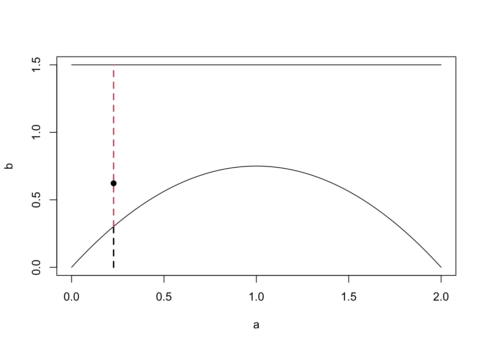
The plot also shows how the choices of $c$ and $q$ can make the sampling more or less efficient. In our example, the rejection space is large, meaning many of our proposed samples will be rejected. Here, we could have chosen a better $q$ or a better $c$ for the given $q$ to minimise this space (compare with the first figure from this subsection).
:::

::: {.example}
Suppose we want to sample from a Beta(4, 8) distribution. This distribution looks like

```r
x <- seq(0, 1, 0.001)
y <- dbeta(x, 4, 8)
plot(x, y, type = 'l')
```

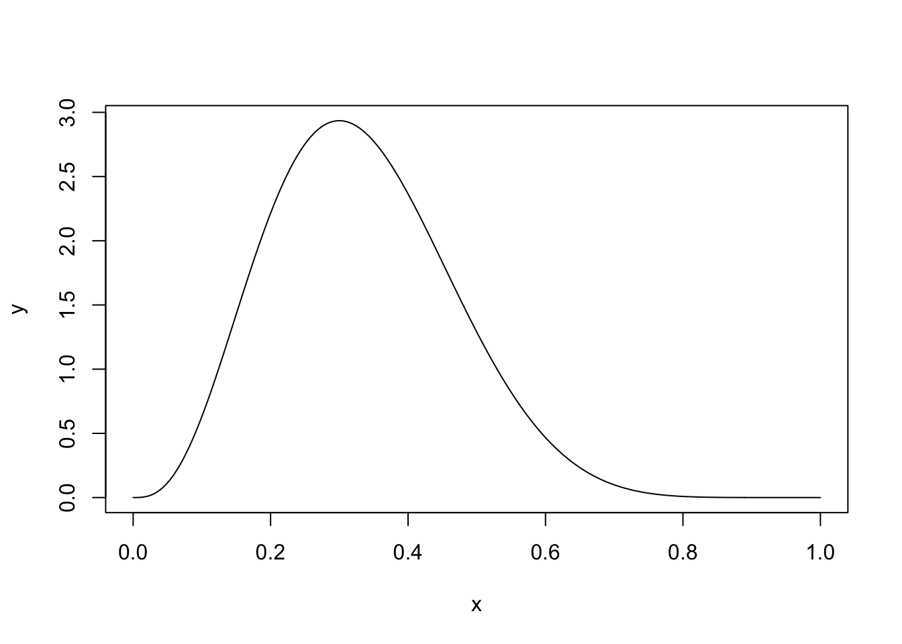
A uniform distribution on [0, 1] will cover the Beta distribution and we can then use a rejection sampling algorithm. First, we need to find $c$, the maximum of the Beta distribution. We can find this by differentiating the pdf and setting it equal to 0:
$$
\pi(x) = \frac{1}{B(4, 8)}x^3(1-x)^7 \\
\implies \frac{d \pi(x)}{d x} = \frac{1}{B(4, 8)}(3x^2(1-x)^7 - 7x^3(1-x)^6) \\
\implies \frac{d \pi(x)}{d x} = \frac{1}{B(4, 8)}(x^2(1-x)^6(3-10x)).
$$
Setting this equal to 0 gives us the maximum at $x = \frac{3}{10}$. This means we can set $c = \pi(3/10) = \frac{1}{B(4, 8)} \frac{3^3 7^{7}}{10^{10}} = \frac{11! 3^3 7^7}{3! 7! 10^{10}} \approx 2.935$. Our rejection sampling algorithm is therefore

1. Sample $u \sim U[0, 1]$
2. Compute $k = \pi(u)/c$. 
3. Accept $u$ with probability $k$. If rejected, repeat.
:::


::: {.example}
In this example, we want to sample from a Gamma(3, 2) distribution. The density function is shown below.

```r
x <- seq(0, 6, 0.01)
y <- dgamma(x, 3, 2)
plot(x, y, type = 'l')
```

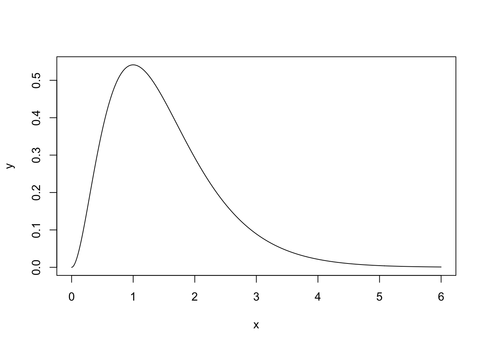

We will use an Exp(1) distribution as our proposal distribution. To find the value of $c$, consider $R(x) = \frac{\pi(x)}{q(x)}$
$$
R(x) = \frac{\frac{2^3}{\Gamma(3)}x^2\exp(-2x)}{\exp(-x)} \\
 =  \frac{2^3}{\Gamma(3)}x^2 \exp(-x)
$$
To find the maximum of this ratio, we differentiate and set the result equal to 0. 
$$
\frac{dR(x)}{dx} = 2x\exp(-x) - x^2\exp(-x)\\
= x\exp(-x)(2 - x)
$$
The maximum is therefore at 2. The value of the ratio at $x = 2$ is $R(2) = \frac{2^3}{\Gamma(3)}4\exp(-2)$. This is therefore our value of c. We can see how $\pi(x)$ and $cq(x)$ look in the graph below. 

```r
x <- seq(0, 6, 0.01)
y <- dgamma(x, 3, 2)
scaling.c <- 2^3/gamma(3)*4*exp(-2)
q <- dexp(x, 1)

plot(x, y, type = 'l')
lines(x, q*scaling.c, col = 2, lty = 2)
```

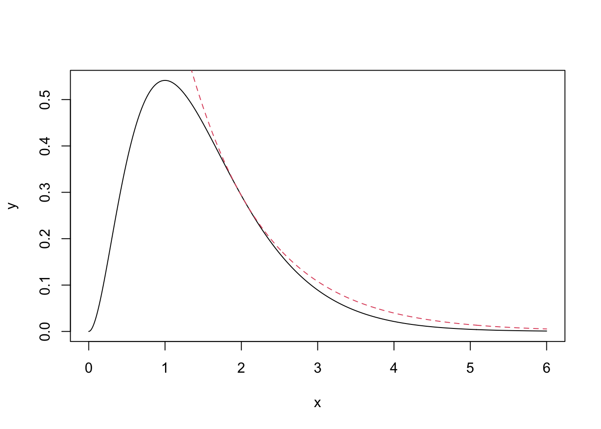

The exponential distribution completely encloses the gamma distribution using this value of $c$, wiht the two densities just touching at $x=2$. Our rejection sampling algorithm is therefore

1. Sample $y \sim \hbox{exp}(1)$
2. Compute $k = \frac{\pi(y)}{cq(y)}$
3. Accept $y$ with probability $k$; else reject and repeat. 
:::

### Rejection Sampling Efficiency
Suppose we are using a rejection sampling algorithm to sample from $\pi(y)$ using the proposal distribution $q(y)$. How good is our rejection sampling algorithm? What does it mean to be a 'good' rejection sampling algorithm. One measure of the efficiency of a sampler is, on average, how many samples do we need to generate until one is accepted. 

::: {.proposition}
The number of samples proposed in a rejection sampling algorithm before one is accepted is distributed geometrically with success probability \(\frac{1}{c}\).
:::

::: {.proof}
Since we sample independently until first success with success  probability (i.e., acceptance probability) $p$, the number of samples proposed until acceptance follows a $\mathrm{Geo}(p)$ distribution. As we saw in Theorem \@ref(thm:accrej), we have $p = 1/c$, which proves the assertion. Do drive the point home, let's redo the calculation for this explicitly:
\begin{align*} 
\mathbb{P}\Big(U \leq \frac{\pi(Y)}{cq(Y)}\Big) &= \int_{\mathbb{R}^2} \mathbf{1}_{\{u \leq \pi(y)/(cq(y))\}} \, \mathbb{P}_U(du) \, \mathbb{P}_Y(dy)\\ 
&= \int_{\mathbb{R}} \int_0^{\pi(y)/cq(y)} \, du \, \mathbb{P}_Y(dy)\\ 
&= \int_{\mathbb{R}} \frac{\pi(y)}{cq(y)} q(y) \, dy\\ 
&= \frac{1}{c} \int_{\mathbb{R}} \pi(y) \, dy = \frac{1}{c}.
\end{align*}
:::
::: {.remark}
In other words, the average number of samples produced until the algorithm terminates is given by the constant $c$. Thus, the tighter we fit the proposal density $q$ to $\pi$, the more efficient our rejection algorithm will be.
:::

## Ziggurat Sampling
The final method we are going to look at in this chapter is Ziggurat sampling. It is generally used to sample from distributions supported on the positive half line with monotone densities, using only uniform samples. It may also be used for sampling from symmetric distributions via a sign flipping argument, as illustrated for a normal distribution below.  Denote its density by $\pi$. 

A Ziggurat is a kind of stepped pyramid. To start the sampling algorithm, we approximate the normal distribution on the positive half line by a series of horizontal rectangles numbered in decreasing order from $n-1$ to $0$ with bottom right corner being denoted by $(x_i,y_i) = (x_i, \pi(x_i))$, where $x_0 = x_1$. We also set $x_n = 0, y_n = \pi(0)$. For the base layer $0$ we then add the tail extending to the right of the $0$-th rectangle, thus obtaining $n-1$ rectangles stacked upon the base layer.  Moreover, the layers are chosen in such a way that they all have the same area $A$ (this can be achieved via a numerical root finding algorithm). An example of this is shown below. 

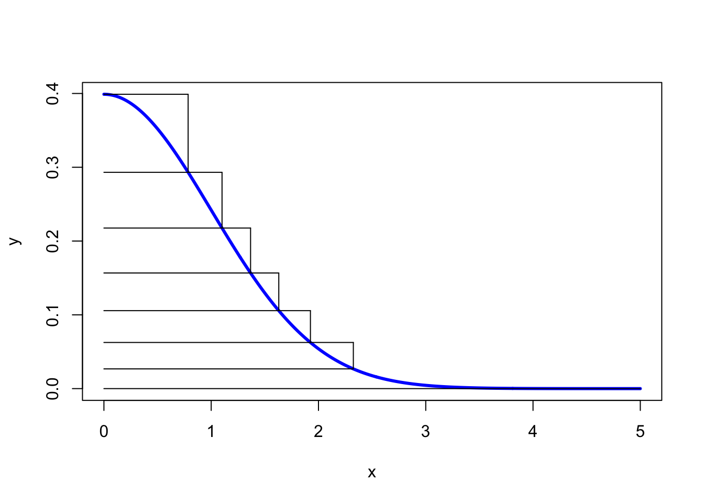

To generate a sample, we choose a layer at random -- we might do this by sampling on the $y$-axis uniformly at random. 

Assume first that we have sampled a layer $i \in \{1,\ldots,n\}$, i.e., a true rectangle. We then sample uniformly at random within the rectangle and accept the sample if it is in the subgraph of the half-normal distribution. This is is done efficiently as follows: First sample uniformly the $x$-value of the sample in the box. If this value is smaller than $x_{i+1}$, then sampling uniformly in $[y_i,y_{i+1}]$ will always return a sample in the subgraph and we can therefore terminate the algorithm and accept $x$. Otherwise we need to sample the $y$-value as well and check if $y < \pi(x)$, in which case we accept, or else reject and select a new layer.

If the base layer is sampled things are a bit more complicated as we may need to sample uniformly from the tail. There are methods to do this efficiently for the half-normal distribution. We will not go into details on this and just note that for a large number of layers (a typical choice is $n=256$) this case occurs very rarely and just ignoring this layer would result in a good, albeit compactly. supported, sample approximation. 

The full Ziggurat algorithm is now

1. Sample a layer $i \in \{0,\ldots,n-1\}$ uniformly at random
2. If $i > 0$, do:
    1. Sample $u_0 \sim U[0, 1]$ and set $x = u_0x_i$
    2. If $x < x_{i+1}$: accept the sample and terminate; else:
    3. Sample $u_1 \sim U[0, 1]$ and set $y = y_i + u_1(y_{i+1} − y_i)$
    4. If $y < \pi(x)$: accept the sample. Else: return to Step 1.
3. Else 
    1. Sample $u_2 \sim U[0,1]$ and set $w = u_2 A$
    2. If $w < x_0y_1$: sample and accept $x \sim U[0,x_0]$
    3. Else: sample from the tail

Finally, to generate samples from the full normal distribution, we multiply each sample by -1 with probability $1/2$. 

## Approximate Bayesian Computation
So far, we have always considered models where the likelihood function is easy to work with. By easy, we mean that we can evaluate the likelihood function for lots of different values, and we can evaluate it cheaply. In some cases, it might not be possible to write down the likelihood function, or it might not be possible to evaluate it. In these cases, we refer to methods call **likelihood free inference**. 

:::{.example}
Models to predict the weather are notoriously complex. They contain a huge number of parameters, and sometimes it is not possible to write this model down exactly. In cases where the likelihood function for the weather model can be written down, we would have to start the MCMC algorithm from scratch every time we collected new data.
:::

Approximate Bayesian Computation (ABC) is a likelihood free algorithm that relies on reject sampling from the prior distribution. When constructing an ABC algorithm, we only need to be able to generate data given a parameter value and not evaluate the likelihood of seeing specific data given a parameter value.

We are going to look at two types of ABC. The first is ABC with rejection

### ABC with Rejection

:::{.definition}
To carry out inference for a parameter $\theta$ using an Approximate Bayesian Computation algorithm with rejection

1. Sample a value for the parameter $\theta^*$ from the prior distribution $\pi(\theta)$. 
2. Generate some data $y*$ from the data generating process using the parameter value $\theta^*$.
3. Accept $\theta^*$ as a value from the posterior distribution if $||y - y^*|| < \varepsilon$ for some $\varepsilon > 0$. Otherwise reject $\theta^*$
4. Repeat steps 1 - 3.
:::

:::{.definition}
The approximate posterior distribution using ABC with rejection is
$$
\pi_\varepsilon(\theta \mid y) \propto \int \pi(y^* \mid \theta)\pi(\theta)\mathbf{1}_{A_\varepsilon(y^*)} dy^*,
$$
where ${A_\varepsilon(y^*)} = \{y^* \mid ||y^* - y||< \varepsilon\}$. 
:::

::: {.example}
This is a simple example, where we can derive the posterior distribution, but it allows us to see how this method works. Suppose we observe $y_1, \ldots, y_{10}$ from $\text{Beta}(3, \beta)$. We placed a uniform prior on $\beta$ such that $\beta \sim \text{Unif}[0, 5]$. The ABC algorithm with rejection works as follows:

1. Sample a value $\beta^* \sim \text{Unif}[0, 5]$. 
2. Simulate $y^*_1, \ldots, y^*_{10} \sim \text{Beta}(3,\beta^*)$
3. Compute $D = \sum_{i=1}^{10}(y_i -y^*_i)^2$. If $D < 0.75$, accept $\beta^*$ as a sample from the posterior distribution. Otherwise, reject $\beta^*$.
4. Repeat steps 1, 2, and 3. 

The code below carries out this algorithm. 


```r
#Set Up Example
set.seed(1234)
n <- 10
y <- rbeta(n, 3, 2)
y
```

```
##  [1] 0.8519237 0.5286251 0.3126172 0.9691679 0.4883547 0.4677043 0.7339799
##  [8] 0.7279578 0.7317827 0.7971786
```

```r
#Set Up ABC
n.iter <- 50000
b.store <- numeric(n.iter)
epsilon <- 0.75

#Run ABC
for(i in 1:n.iter){
  
  #Propose new beta
  b <- runif(1, 0, 5)
  
  #Simualate data
  y.star <- rbeta(n, 3, b)
  
  #Compute statistic
  d <- sum((y-y.star)^2)
  
  #Accept/Reject
  if(d < epsilon){
    b.store[i] <- b
  } else{
    b.store[i] <- NA
  }
  
}

#Get number of reject samples
sum(is.na(b.store))
```

```
## [1] 37886
```

```r
#Plot Approximate Posterior
hist(b.store, freq = FALSE, xlab = expression(beta), main = "")
abline(v = 2, col = 'red')
```

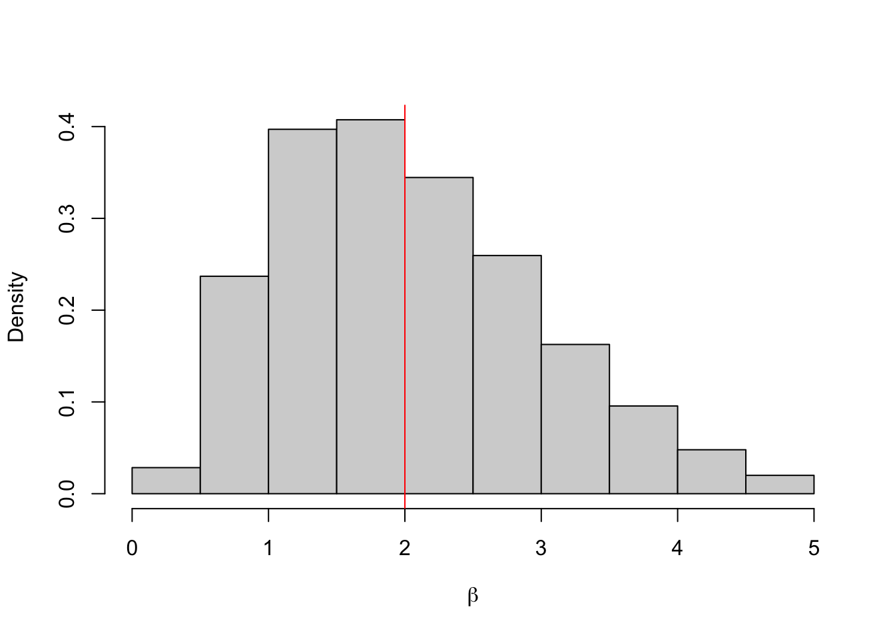

```r
mean(b.store, na.rm = TRUE)
```

```
## [1] 2.03304
```

```r
quantile(b.store, c(0.025, 0.975), na.rm = TRUE)
```

```
##      2.5%     97.5% 
## 0.5843792 4.1369339
```
:::


One important question is how to choose the value for $\varepsilon$? It turns out this is an incredibly hard question that is specific to each application. Often the approximate posterior distribution $\pi_\varepsilon(\theta \mid y)$ is very sensitive to the choice of $\varepsilon$. 

:::{.example}
Let's repeat the example, first with $\varepsilon = 0.12$. In this case, almost all of the proposals are rejected. 

```r
#Set Up Example
set.seed(1234)
n <- 10
y <- rbeta(n, 3, 2)
y
```

```
##  [1] 0.8519237 0.5286251 0.3126172 0.9691679 0.4883547 0.4677043 0.7339799
##  [8] 0.7279578 0.7317827 0.7971786
```

```r
#Set Up ABC
n.iter <- 50000
b.store <- numeric(n.iter)
epsilon <- 0.12

#Run ABC
for(i in 1:n.iter){
  
  #Propose new beta
  b <- runif(1, 0, 5)
  
  #Simualate data
  y.star <- rbeta(n, 3, b)
  
  #Compute statistic
  d <- sum((y-y.star)^2)
  
  #Accept/Reject
  if(d < epsilon){
    b.store[i] <- b
  } else{
    b.store[i] <- NA
  }
  
}

#Get number of reject samples
sum(is.na(b.store))
```

```
## [1] 49993
```

```r
#Plot Approximate Posterior
hist(b.store, freq = FALSE, xlab = expression(beta), main = "")
abline(v = 2, col = 'red')
```

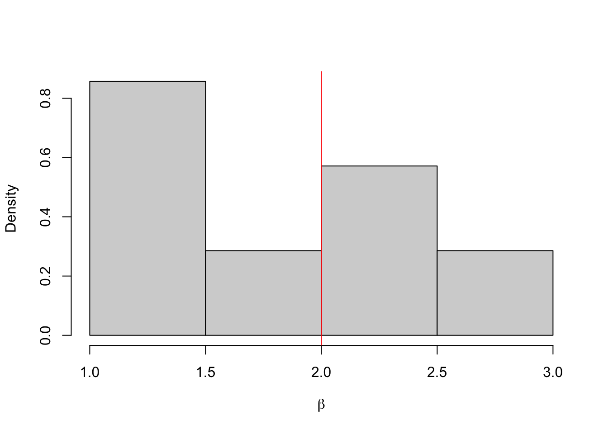

```r
mean(b.store, na.rm = TRUE)
```

```
## [1] 1.831118
```

```r
quantile(b.store, c(0.025, 0.975), na.rm = TRUE)
```

```
##     2.5%    97.5% 
## 1.181349 2.587056
```
:::

:::{.example}
And now again with $\varepsilon = 2$. In this case, almost all of the proposals are accepted.  

```r
#Set Up Example
set.seed(1234)
n <- 10
y <- rbeta(n, 3, 2)
y
```

```
##  [1] 0.8519237 0.5286251 0.3126172 0.9691679 0.4883547 0.4677043 0.7339799
##  [8] 0.7279578 0.7317827 0.7971786
```

```r
#Set Up ABC
n.iter <- 50000
b.store <- numeric(n.iter)
epsilon <- 2

#Run ABC
for(i in 1:n.iter){
  
  #Propose new beta
  b <- runif(1, 0, 5)
  
  #Simualate data
  y.star <- rbeta(n, 3, b)
  
  #Compute statistic
  d <- sum((y-y.star)^2)
  
  #Accept/Reject
  if(d < epsilon){
    b.store[i] <- b
  } else{
    b.store[i] <- NA
  }
  
}

#Get number of reject samples
sum(is.na(b.store))
```

```
## [1] 471
```

```r
#Plot Approximate Posterior
hist(b.store, freq = FALSE, xlab = expression(beta), main = "")
abline(v = 2, col = 'red')
```

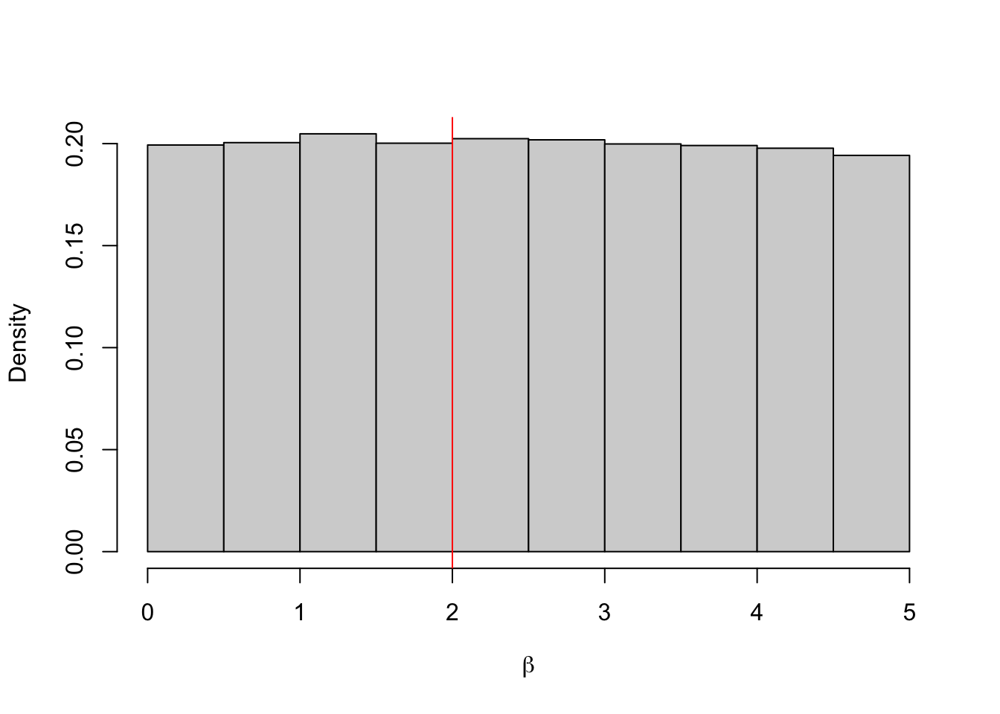

```r
mean(b.store, na.rm = TRUE)
```

```
## [1] 2.488073
```

```r
quantile(b.store, c(0.025, 0.975), na.rm = TRUE)
```

```
##      2.5%     97.5% 
## 0.1281937 4.8666030
```
When $\varepsilon = 0.12$, almost all the proposals are rejected. Although the approximate posterior mean is close to the true value, given we only have 7 samples we cannot say much about the posterior distribution.  When $\varepsilon = 2$, almost all the proposals are accepted. This histogram shows that we are really just sampling from the prior distribution, i.e. $\pi_2(\beta \mid y) \approx \pi(\beta)$. 
:::

:::{.proposition}
Using an ABC rejection algorithm
$$
\lim_{\varepsilon \rightarrow \infty} \pi_\varepsilon(\theta \mid y) \overset{D}= \pi(\theta),
$$
and 
$$
\lim_{\varepsilon \rightarrow 0} \pi_\varepsilon(\theta \mid y) \overset{D}= \pi(\theta \mid y). 
$$
:::

This example and the proposition show that if we set $\varepsilon$ too large, we don't learn anything about $\theta$, we just recover the prior distribution. The smaller the value of $\varepsilon$, the better. But very small values may require very long run times, or have such few samples that the noise from the sampling generator is larger than the signal in the accepted samples. The only diagnostic tools we have are the proportion of samples accepted and the histograms of the approximate posterior and prior distributions.

<!--
:::{.example}
An example of where this is useful is epidemic modelling. Suppose we have a population of 100 individuals and at each time point an individual is in one of the three states: Susceptible to a disease, Infected with the disease, or Recovered and therefore immune. Once infected with the disease, an individual infects people according to a Poisson process with rate $\beta$. Each infected person is infected from a time period drawn from an Exponential distribution with rate $1$. We observe the total number of people infected with the disease at the end of the outbreak. To carry out inference for the infection rate $\beta$, we need to use the augmented likelihood function. The augmented likelihood function for this model is given by

$$
\pi(\textbf{i}, \textbf{r}| \beta) \propto \underbrace{\exp\Big(- \sum\limits_{j=1}^n\sum\limits_{k=1}^N \beta\big((r_j \wedge i_k) - (i_j \wedge i_k)\big)\Big)}_\text{Avoiding infection} \\
 \times\hspace{1.8cm} \underbrace{\prod\limits_{\substack{j=1 \\ j \neq \kappa}}^n\Big(\sum\limits_{k \in \mathcal{Y}_j} \beta\Big)}_\text{Becoming infectious}  \\
\times \hspace{1.8cm}\underbrace{\prod\limits_{j=1}^n\pi(r_j -i_j | \gamma = 1)}_\text{Remaining infected}.
$$
This likelihood function cannot be evaluated as we do not observe the infection time $i$ or recovery time $r$. Instead we can use ABC sampling with rejection. Each iteration, sample a value for $\beta$, simulate an outbreak and compare the observed and simulated number of people infected. If they are 'close' we accept the value for $\beta$ as a sample from our posterior distribution. This means all we have to do is simulate outbreaks.  


```r
#This function simualtes an outbreak of a disease in a population of size N, with infection rate beta and recovery rate gamma.
simSIR.Markov <- function(N, beta, gamma) {
  
  # initial number of infectives and susceptibles;
  I <- 1
  S <- N-1;
  
  # recording time;
  t <- 0;
  times <- c(t);
  
  # a vector which records the type of event (1=infection, 2=removal)
  type <- c(1);
  
  while (I > 0) {
    
    # time to next event;
    t <- t + rexp(1, (beta/N)*I*S + gamma*I);
    times <- append(times, t);
    
    if (runif(1) < beta*S/(beta*S + N*gamma)) {
      # infection
      I <- I+1;
      S <- S-1;
      type <- append(type, 1);
    }
    else {
      #removal
      I <- I-1
      type <- append(type, 2);
    }
  }
  
  
  # record the times of events (infections/removals), the type of the event, the final size (including
  # the initial infective) and the duration. 
  
  res <- list("t" = times, "type" = type, "final.size" = sum(type==1), "duration" = t, "N" = N);
  return(res)
}

#Set Up Example
set.seed(1234)
n <- 200
y <- simSIR.Markov(100, 2, 1)$final.size


#Set Up ABC
n.iter <- 50000
b.store <- numeric(n.iter)
epsilon <- 250

#Run ABC
for(i in 1:n.iter){
  
  #Propose an infection rate
  b <- runif(1, 0, 5)
  
  #Simualte an outbreak
  y.star <- simSIR.Markov(100, b, 1)$final.size
  
  #Compute difference
  d <- sum((y-y.star)^2)
  
  #Accept/Reject
  if(d < epsilon){
    b.store[i] <- b
  } else{
    b.store[i] <- NA
  }
  
}

#Get number of reject samples
sum(is.na(b.store))
```

```
## [1] 39166
```

```r
#Plot Approximate Posterior
hist(b.store, freq = FALSE, xlab = expression(beta), main = "")
abline(v = 2, col = 'red')
```

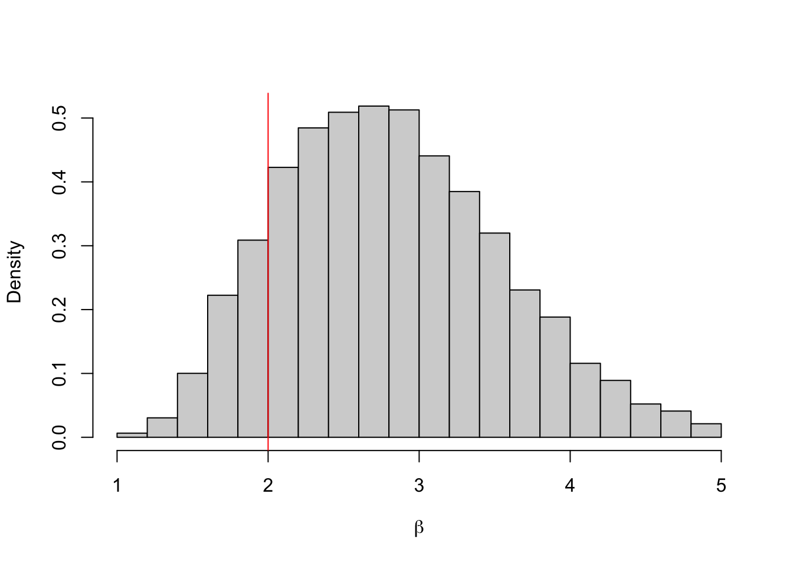

```r
mean(b.store, na.rm = TRUE)
```

```
## [1] 2.811462
```

```r
quantile(b.store, c(0.025, 0.975), na.rm = TRUE)
```

```
##     2.5%    97.5% 
## 1.589679 4.367686
```
:::
-->

### Summary ABC with Rejection
ABC with rejection suffers from the curse of dimensionality (see Chapter 5). As the number of data points increases, the probability we get a 'close' match decreases. This means we have to increase $\varepsilon$ and degrade the quality of our approximation. 

:::{.example}
Let's repeat the Beta example with $n = 200$ observed data points. We need $\varepsilon > 15$ for any proposals to be accepted. 
:::


We can avoid the curse of dimensionality by comparing summary statistics instead. This leads us to the Summary ABC algorithm. 

:::{.definition}
To carry out inference for a parameter $\theta$ using an Summary Approximate Bayesian Computation algorithm with rejection

1. Sample a value for the parameter $\theta^*$ from the prior distribution $\pi(\theta)$. 
2. Generate some data $y*$ from the data generating process using the parameter value $\theta^*$.
3. Accept $\theta^*$ as a value from the posterior distribution if $||S(y) - S(y^*)|| < \varepsilon$ for some $\varepsilon > 0$ and summary summary statistic $S$. Otherwise reject $\theta^*$
4. Repeat steps 1 - 3.
:::


Similar to the ABC algorithm with rejection, we also have the following proposition. 

:::{.proposition}
The approximate posterior distribution using ABC with rejection is
$$
\pi_\varepsilon(\theta \mid S(y)) \propto \int \pi(y^* \mid \theta)\pi(\theta)\mathbf{1}_{A_\varepsilon(y^*)} dy^*,
$$
where ${A_\varepsilon(y^*)} = \{y^* \mid ||S(y^*) - S(y)||< \varepsilon\}$. 
:::

Using summary statistics only increases the level of ''approximation'', as we are approximating the data using a summary of it. The only case when we are not approximating further is when the statistic  contains all the information about the underlying sample it is summarising. This is known as a sufficient statistic. 

:::{.definition}
A statistic $S$ is a sufficient statistic for the parameter $\theta$ if the conditional distribution $\pi(y | S(y))$ does not depend on $\theta$. 
:::

:::{.proposition}
Using a Summary ABC rejection algorithm with a sufficient statistic $S$
$$
\lim_{\varepsilon \rightarrow 0} \pi_\varepsilon(\theta \mid S(y)) \overset{D}= \pi(\theta \mid y).
$$
:::

The difficulty with sufficient statistics is that they only exist for 'nice' distributions, like the Gamma, Beta and Poisson distributions. In these cases, we can work with the posterior distribution directly or use MCMC algorithms. 

:::{.example}
Let's repeat the beta distribution example using the mean as the summary (but not sufficient) statistic. We can set $\varepsilon = 0.001$. 


```r
set.seed(1234)
n <- 200
y <- rbeta(n, 3, 2)


n.iter <- 50000
b.store <- numeric(n.iter)
epsilon <- 0.001
for(i in 1:n.iter){
  
  b <- runif(1, 0, 5)
  
  y.star <- rbeta(n, 3, b)
  
  d <- sum((mean(y)-mean(y.star))^2)
  
  if(d < epsilon){
    b.store[i] <- b
  } else{
    b.store[i] <- NA
  }
  
}

#Get number of reject samples
sum(is.na(b.store))
```

```
## [1] 45028
```

```r
#Plot Approximate Posterior
hist(b.store, freq = FALSE, xlab = expression(beta), main = "")
abline(v = 2, col = 'red')
```

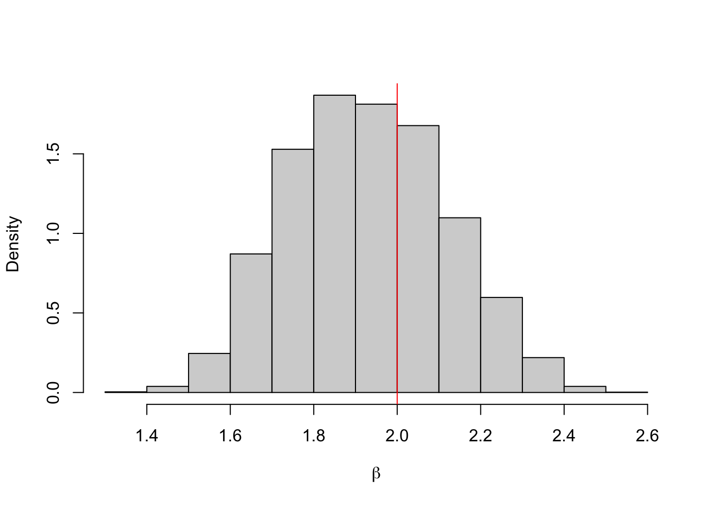

```r
mean(b.store, na.rm = TRUE)
```

```
## [1] 1.930908
```

```r
quantile(b.store, c(0.025, 0.975), na.rm = TRUE)
```

```
##     2.5%    97.5% 
## 1.593348 2.302256
```
:::


## Lab

The aim of this lab is to code up some sampling methods. You have already done some similar work in lab 1 (e.g. estimating $\pi$). 

::: {.exercise}
Visit random.org to generate some truly random numbers. How does this site generate numbers that are truly random?
:::

::: {.exercise}
A random variable $X$ has density $\pi(x) = ax^2$ for $x\in[0,1]$ and 0 otherwise.  Find the value $a$. Use the inverse transform method to generate 10,000 samples from this distribution. Plot a histogram against the true density function. 
:::

::: {.exercise}
Let $X$ have the density $\pi(x) = \frac{1}{\theta}x^{\frac{1-\theta}{\theta}}$ for $x \in [0, 1]$. Use the inverse transform method to generate 10,000 samples from this distribution with $\theta = \{1, 5, 10\}$. 
:::

::: {.exercise}
Let $X$ have the density $\pi(x) = 3x^2$ for $x \in [0, 1]$ and 0 otherwise. Use a rejection sampling method to generate 10,000 from this distribution. Plot the results against the true density to check you have the same distribution. 
:::

::: {.exercise}
The half normal distribution with mean 0 and variance 1 has density function 
$$
\pi(x) = \frac{2}{\sqrt{2\pi}}\exp{(-x^2/2)}
$$
for $x \geq 0$ and 0 otherwise.

1. Denote the exponential density function by $q(x) = \lambda \exp(-\lambda x)$. Find the smallest $c$ such that  $\pi(x)/q(x) < c$. 
2. Use a rejection sampling algorithm with an exponential proposal distribution to generate samples from the half normal distibrution with mean 0 and variance 1. 
:::

:::{.exercise}
You observe the following data from an $N(5, \sigma^2)$ distribution. 
```
-5.93,  33.12, -21.41, -12.42, -17.64,  -5.47, -27.95, -22.25, -20.40, -26.28, -24.57,  
3.06,  44.28, 6.02, -21.14,  14.79, -15.10, 53.18,  38.61,   5.71
```
Use an Exp(0.1) prior distribution on $\sigma^2$ and develop a summary statistic ABC algorithm to draw samples from the approximate posterior distribution. 
:::

:::{.exercise}
You observe the following data from an $Exp(\lambda)$ distribution. 
```
2.6863422, 8.8468112, 8.8781831, 0.2712696, 1.8902442
```
Use an $Beta(1, 3)$ prior distribution on $\lambda$ and develop an ABC algorithm to draw samples from the approximate posterior distribution. Write the ABC algorithm as a function so you can run it for different values of $\varepsilon$. Run your algorithm for $\varepsilon = \{20, \ldots, 100\}$ and record the approximate posterior median. Plot the relative error in your estimate against the true value of lambda, which is 0.2. 
:::


