# Advanced Computation

Now we have the tools of Bayesian inference and methods to sample from complex posterior distributions, we can start to look at more advanced methods and models. This chapter is split into distinct parts, each showing a different method in Bayesian inference.

## Gaussian Processes

So far in the module, we have considered prior distribution on parameters. These parameters have taken values (mostly real) or real-valued vectors. In this section, we're going to extend this idea further to place prior distributions on functions. That is, we're going to describe a prior distribution that when sampled gives us functions. The method we're going to use is called a Gaussian Process (GP). 


Before, we define a GP, we're going to build an intuitive definition of it. Recall the normal distribution with mean $\mu$ and variance $\sigma^2$, $N(\mu, \sigma^2)$. It assigns probabilities to values on the real line -- when we sample from it, we get real values. The plot below shows the density function for a $N(0, 1)$ distribution and five samples.

```r
#Plot N(0, 1)
x <- seq(-4, 4, 0.01)
y <- dnorm(x)
plot(x, y, type = 'l')

#Add samples
samples <- rnorm(5)
rug(samples)
```

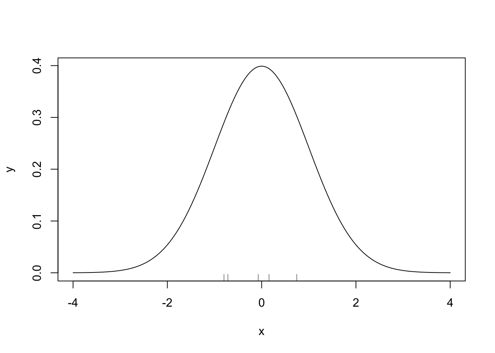

The multivariate normal distribution extends this to the vector space $\mathbb{R}^N$. Instead of having a mean and variance value, the distribution is defined through a mean vector and covariance matrix. The mean vector describes the expected value of each component of the vector and the covariance matrix describes the relationship between each pair of components in the vector. When we draw samples, we get vectors. The plot below shows the density of the multivariate normal distribution with $N = 2$, zero mean, $\sigma^2_x = \sigma^2_y = 1$ and $\rho = 0.7$. 


```r
#Create Grid
x <- seq(-3,3,length.out=100)
y <- seq(-3,3,length.out=100)

#Evaluate density at grid
z <- matrix(0,nrow=100,ncol=100)
mu <- c(0,0)
sigma <- matrix(c(1, 0.7, 0.7, 1),nrow=2)
for (i in 1:100) {
  for (j in 1:100) {
    z[i,j] <- mvtnorm::dmvnorm(c(x[i],y[j]),
                      mean=mu,sigma=sigma)
  }
}

#Generate contour plot
contour(x, y ,z)
```

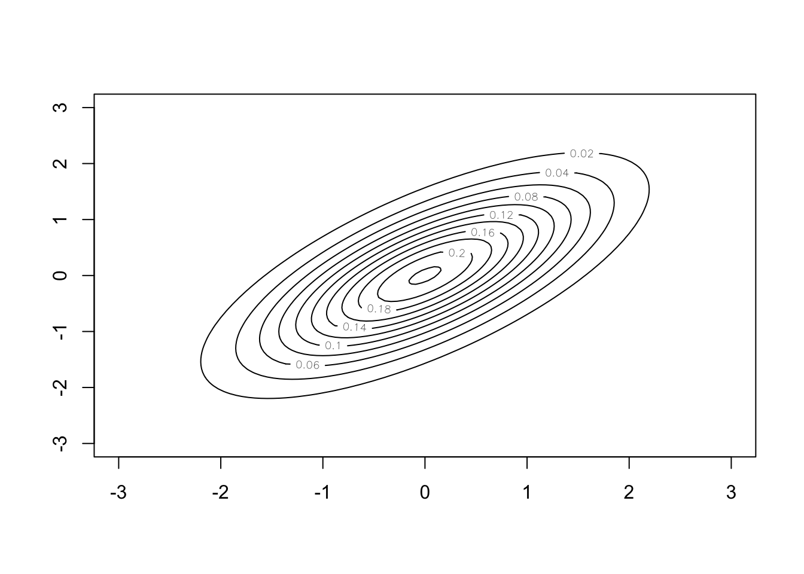

A GP takes this one step further and puts a prior distribution on a function space. It is specified by a mean function, $\mu(\cdot)$ and covariance function $k(\cdot, \cdot)$. The mean function describes the expected value of each point the function can be evaluated at, and the covariance function describes the relationship between each point on the function. The plot below shows three samples from a GP distribution with mean function the zero function $\mu(x) = 0\, \forall x$ and a covariance function that supports smooth functions. 

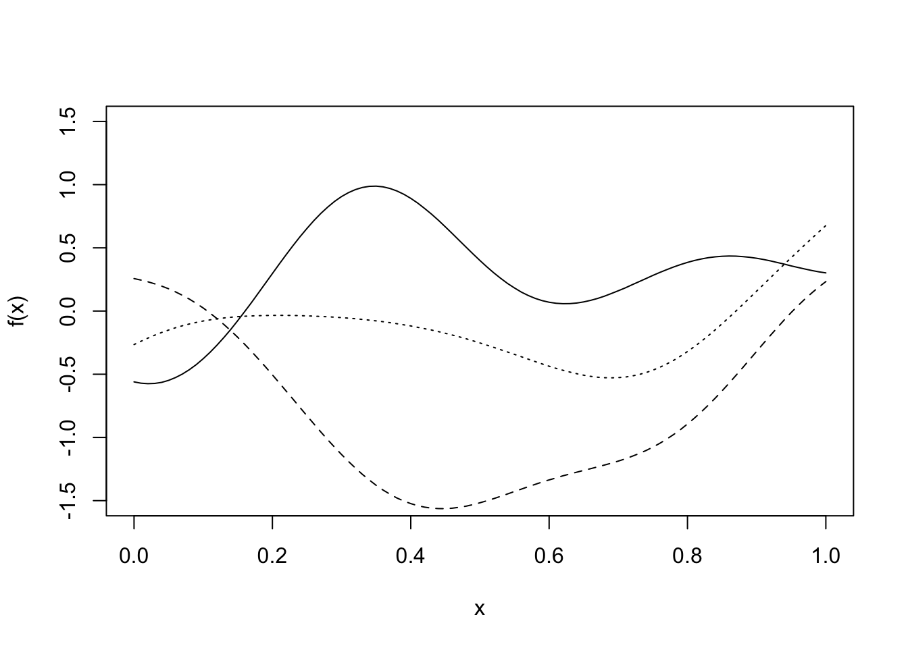

::: {.definition}
A **Gaussian Process** $X = (X(t))_{t \in T}$ is a collection of real-valued random variables  indexed by some index set $T$, any finite number of which have a joint Gaussian distribution. Its mean function $T \ni t \mapsto \mu(t)$ is defined by $\mu(t) = \E[X(t)]$ and its covariance function $k(s,t) = \mathrm{Cov}(X(s), X(t)) = \mathbb{E}\left((X(s) - \mu(s))(X(t) - \mu(t))\right)$.
:::

It can be shown that a Gaussian process is uniquely characterised by its mean and covariance *function*, just as a multivariate normal distribution is uniquely characterised by its mean *vector*  and covariance *matrix*.

Our particular interest is on Gaussian processes on real valued functions defined on $\mathbb{R}^N$, and therefore for the particular index set $T = \mathbb{R}^N$. In this case we use the notation $(f(x))_{x \in \mathbb{R}^N}$ for such a *random* function, which we formalise as follows:

::: {.definition}
A **GP on a function** $f = (f(x))_{x \in \mathbb{R}^N}$ is defined through its mean function $\mu(x) = \mathbb{E}[f(x)]$ and covariance function $k(x, x') = \mathrm{Cov}(f(x),f(x^\prime)) = \mathbb{E}\left[(f(x) - \mu(x))(f(x') - \mu(x'))\right]$, where $x,x^\prime \in \mathbb{R}^N$. We write this as $f \sim \mathcal{GP}(\mu, k)$.
:::

In particular, for such a Gaussian process $f$, we have that 
\[\forall n \in \mathbb{N}, \boldsymbol{x} = (x_1,\ldots  x_n) \in (\mathbb{R}^N)^n: f(\boldsymbol{x}) := (f(x_1),\ldots,f(x_n)) \sim N\big(\mu(\boldsymbol{x}) , k(\boldsymbol{x},\boldsymbol{x})\big),\]
where $\mu(\boldsymbol{x}) := (\mu(x_1),\ldots, \mu(x_n))$ and $k(\boldsymbol{x},\boldsymbol{x}) := (k(x_i,x_j))_{i,j = 1,\ldots, n}$.

Before we go any further, it is worth proceeding with caution. Those with good memories will recall Bernstein-von-Mises' theorem from Chapter 3.

::: {.theorem name="Bernstein-von-Mises"}
For a well-specified model $\pi(\boldsymbol{y} \mid \theta)$ with a fixed number of parameters, and for a smooth prior distribution $\pi(\theta)$ that is non-zero around the MLE $\hat{\theta}$, then
$$
\left|\left| \pi(\theta \mid \boldsymbol{y}) - N\left(\hat{\theta}, \frac{I(\hat{\theta})^{-1}}{n}\right) \right|\right|_{TV} \rightarrow 0.
$$
:::
Bernstein-von-Mises' theorem only holds when the model has a fixed (i.e. finite) number of parameters. A GP is defined on an infinite collection of points, and so this theorem does not hold. This is the first time in this module we have encountered a distribution where Bernstein-von-Mises' theorem does not hold. Fortunately, various forms of Bernstein-von-Mises' theorems for GPs exist, with many coming about in the early 2010s. However, this is still an ongoing area of research.

### Covariance Functions
One issue when using GPs is describing the covariance function. How do we decide how each pair of points (there being an infinite number of them)? There are lots of standard choices of covariance functions that we can choose from, each one making different assumptions about the function we are interested in. 

The most common covariance function is the squared exponential functions. It is used to model functions that are 'nice', i.e. they are smooth, continuous and infinitely differentiable. 

:::{.definition} 
The **squared exponential covariance function** takes the form
$$
k(x, x') = \alpha^2\exp\left\{-\frac{1}{l^2}(x-x')^2\right\},
$$
where $\alpha^2$ is the signal variance and $l>0$ is the length scale parameter.
:::

The  length scale parameter $l$  dictates how quickly the covariance decays with increasing distance of points. Very small values of $l$ imply that even for nearby points $x, x^\prime$ the random values $f(x)$ and $f(x^\prime)$ can have very little correlation (recall that since the joint distribution is normal, zero correlation would actually be equivalent to independence),  resulting in functions that look like white noise. Large values of $l$ mean that even if points are far away, they can still highly dependent on each other. This gives rather smooth functions. 

The plot below shows the covariance for $\alpha = l = 1$ between $f(0)$ and $f(x)$ as a function of $x$.

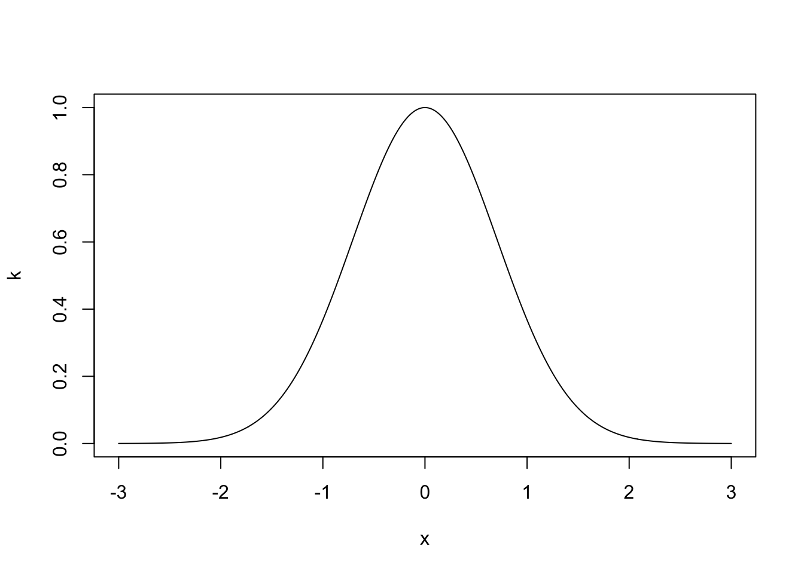


The choice of covariance function is a modelling choice -- it depends completely on the data generating process you are trying to model. The following properties are useful when deciding which covariance function to use. 

:::{.definition}
A **stationary** covariance function is a function of $x - x'$. That means it is invariant to translations in space.
:::

:::{.definition}
An **isotropic** covariance function is a function only of $|x - x'|$. That means it is invariant to rigid transformations in space.
:::

:::{.definition}
An **dot product** covariance function is a function only of $x\cdot x'$. That means it is invariant to rigid rotations in space, but not translations.
:::

What is most important is that the matrix resulting from a covariance function is positive semi-definite to be a valid choice for a Gaussian process. This is because covariance matrices must be positive semi-definite. More formally:

:::{.definition}
An $n \times n$ matrix $\Sigma$ is positive semi-definite if 
$$
x^T\Sigma x \geq 0 \quad \hbox{for all } x \in \mathbb{R}^n.
$$
A  function $k\colon \mathbb{R}^N \times \mathbb{R}^N \to \mathbb{R}$ is called a covariance function if for any $\boldsymbol{x} = (x_1,\ldots,x_n) \in (\mathbb{R}^N)^n$ it holds that $k(\boldsymbol{x},\boldsymbol{x})$ is symmetric positive semi-definite.
:::


The squared exponential covariance function is isotropic and produces functions that are continuous and differentiable. There are many other types of covariance functions, including ones that don't produce functions that are continuous or differentiable. Three more are given below. 

:::{.definition}
The **Matérn** covariance function models functions that are differentiable only once:
$$
k(x, x') = \left(1 + \frac{\sqrt{3}\lvert x - x'\rvert}{l} \right)\exp\left\{-\frac{\sqrt{3}\lvert x - x'\rvert}{l} \right\}.
$$
:::

:::{.definition}
The **periodic** covariance function models functions that are periodic and it is given by
$$
k(x, x') = \alpha^2 \exp\left\{-\frac{2}{l}\sin^2\frac{\lvert x-x'\rvert^2}{p} \right\},
$$
where the period is $p$.
:::

:::{.definition}
The **dot product** covariance function models functions that are rotationally invariant and it is given by
$$
k(x, x') = \alpha^2 + x\cdot x'.
$$
:::

These are just some covariance functions. In addition to the covariance functions defined, we can make new covariance functions by combining existing ones. 

:::{.proposition}
If $k_1$ and $k_2$ are covariance functions, then so is $k = k_1 + k_2$.
:::

:::{.proof}
Let $n \in \mathbb{N}$, $x_1,\ldots,x_n \in \mathbb{R}^N$ and $a \in \R^n$ be arbitrarily chosen. Then,
\[a^\top k(\boldsymbol{x},\boldsymbol{x}) a = \underbrace{a^\top k_1(\boldsymbol{x},\boldsymbol{x}) a}_{\geq 0} + \underbrace{a^\top k_2(\boldsymbol{x},\boldsymbol{x}) a}_{\geq 0} \geq 0, \]
so $k$ is positive semidefinite. Moreover, since $k_i(\boldsymbol{x},\boldsymbol{x})$ are symmetric, so is $k_1(\boldsymbol{x},\boldsymbol{x}) + k_2(\boldsymbol{x},\boldsymbol{x})$. Since $n$, $x_1,\ldots,x_n$ and $a$ were arbitrarily  demonstrates that $k_1+k_2$ is a covariance function. An alternative probabilistic proof would be this: let $f_1$ and $f_2$ be *independent* Gaussian processes with covariance functions $k_1$ and $k_2$ and zero mean function, respectively. For any $\boldsymbol{x} = (x_1,\ldots,x_n)$ we then have $f_i(\boldsymbol{x}) \sim N(\boldsymbol{0}, k_i(\boldsymbol{x},\boldsymbol{x}))$ and therefore by independence of $f_1$ and $f_2$, 
\[f_1(\boldsymbol{x}) + f_2(\boldsymbol{x}) \sim N\big(\boldsymbol{0}, k_1(\boldsymbol{x},\boldsymbol{x}) + k_2(\boldsymbol{x},\boldsymbol{x})\big) = N\big(\boldsymbol{0}, k(\boldsymbol{x},\boldsymbol{x})\big),\]
so $k$ is a covariance function.
:::

:::{.proposition}
If $k_1$ and $k_2$ are covariance functions, then so is $k_1k_2$.
:::

:::{.proof}
See problem sheet.
:::


### Gaussian Process Regression
One of the main applications of GPs in in regression. Suppose we observe the points below $\boldsymbol{y} = \{y_1, \ldots, y_N\}$ and want to fit a curve through them. One method is to write down a set of functions of the form $\boldsymbol{y} =  X^T\boldsymbol{\beta} + \boldsymbol{\varepsilon}$, where $X$ is the design matrix and $\boldsymbol{\beta}$ a vector of parameters. For each design matrix $X$, construct the posterior distributions for $\boldsymbol{\beta}$ and use some goodness-of-fit measure to choose the most suitable design matrix.

One difficulty is writing down the design matrices $X$, it is often not straightforward to propose or justify these forms GPs allow us to take a much less arbitrary approach, simply saying that $y_i = f(x_i) + \varepsilon_i$ and placing a GP prior distribution on $f$. 

Although we're placing an prior distribution with an infinite dimension on $f$, we only ever need to work with a finite dimensional object, making this much easier. We only have noisy observations of the function $\boldsymbol{f} = \{f(x_1), \ldots, f(x_n)\}$ at a finite number of points  and we aim to infer the value of the function at points on a fine grid, $\boldsymbol{f}^* = \{f(x_1^*), \ldots, f(x_{n^\ast}^*)\}$. By the definition of a GP, the distribution of these points is a multivariate normal distribution. 

:::{.example}
Suppose we observe $\boldsymbol{y} = \{y_1, \ldots, y_n\}$ at $\boldsymbol{x} = \{x_1, \ldots, x_n\}$. The plot below shows these points. 


```r
x <- -5:5
y <- sin(x/2)^2 + exp(-x/5) + rnorm(length(x), 0, 0.2)
plot(x, y)
```

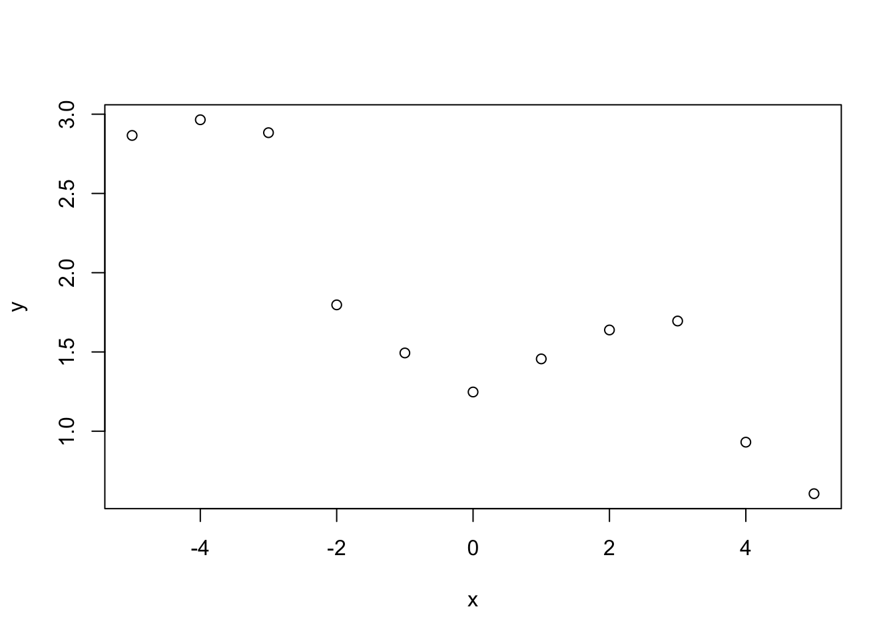

Using the model $y_i = f(x_i) + \varepsilon_i$, where $\varepsilon_i \sim N(0, \sigma^2)$, we want to infer the function $f$ evaluated at a grid of points $\boldsymbol{f}^* = \{f(x_1^*), \ldots, f(x_{n^\ast}^*)\}$. We place a GP prior distribution on $f$, i.e.\  $f \sim \mathcal{GP}(0, k)$, where $k$ is some covariance function (in the simulation below the squared exponential) and assume that $f$ is independent of $\varepsilon_1,\ldots,\varepsilon_n$. Using the model, the covariance between points $y_i$ and $y_j$
$$
\mathrm{Cov}(y_i, y_j) = k(x_i, x_j) + \sigma^2 \mathbf{1}_{i=j}.
$$
That is the covariance function evaluated at $x_i$ and $x_j$ plus $\sigma^2$ if $i = j$. We can write this in matrix form as $\mathrm{Cov}(\boldsymbol{y},\boldsymbol{y}) = k(\boldsymbol{x}, \boldsymbol{x}) + \sigma^2I$ where $I$ is the identity matrix. The distribution of $\boldsymbol{y}$ is therefore $\boldsymbol{y} \sim N(\boldsymbol{0}, \, k(\boldsymbol{x}, \boldsymbol{x}) + \sigma^2I)$. By definition of the GP, the distribution of the function evaluated at the fine grid is $\boldsymbol{f}^* \sim N(\boldsymbol{0}, k(\boldsymbol{x}^*, \boldsymbol{x}^*))$. 

We can now write the joint distribution as
$$
\begin{pmatrix}
\boldsymbol{y} \\
\boldsymbol{f}^*
\end{pmatrix} \sim N\left(\boldsymbol{0}, \,
\begin{pmatrix}
 k(\boldsymbol{x}, \boldsymbol{x}) + \sigma^2I &  k(\boldsymbol{x}, \boldsymbol{x}^*)\\
k(\boldsymbol{x}^*, \boldsymbol{x}) & k(\boldsymbol{x}^*, \boldsymbol{x}^*)
\end{pmatrix}.
\right)
$$
The off-diagonal terms in the covariance matrix describe the relationship between the observed points $\boldsymbol{y}$ and the points of interest $\boldsymbol{f}^*$. We can now write down the predictive distribution of $\boldsymbol{f}^*$ given the observed points $(\boldsymbol{x},\boldsymbol{y})$. 
$$
\boldsymbol{f}^* \mid \boldsymbol{y} \sim N(\boldsymbol{\mu}^*, K^*),
$$
where $\boldsymbol{\mu}^* = k(\boldsymbol{x}^*, \boldsymbol{x})(k(\boldsymbol{x}, \boldsymbol{x}) + \sigma^2 I)^{-1} \boldsymbol{y}$ and $K^* = k(\boldsymbol{x}^*, \boldsymbol{x}^*) -  k(\boldsymbol{x}^*, \boldsymbol{x})(k(\boldsymbol{x}, \boldsymbol{x}) + \sigma^2I)^{-1}k(\boldsymbol{x}, \boldsymbol{x}^*)$. 

We set the fine gird to be $\boldsymbol{x}^* = \{-5, -4.99, -4.98, \ldots, 5\}$, the GP parameters $\alpha = l = 1$ and $\sigma = 0.2$. The posterior mean and 95\% credible interval are shown below. 
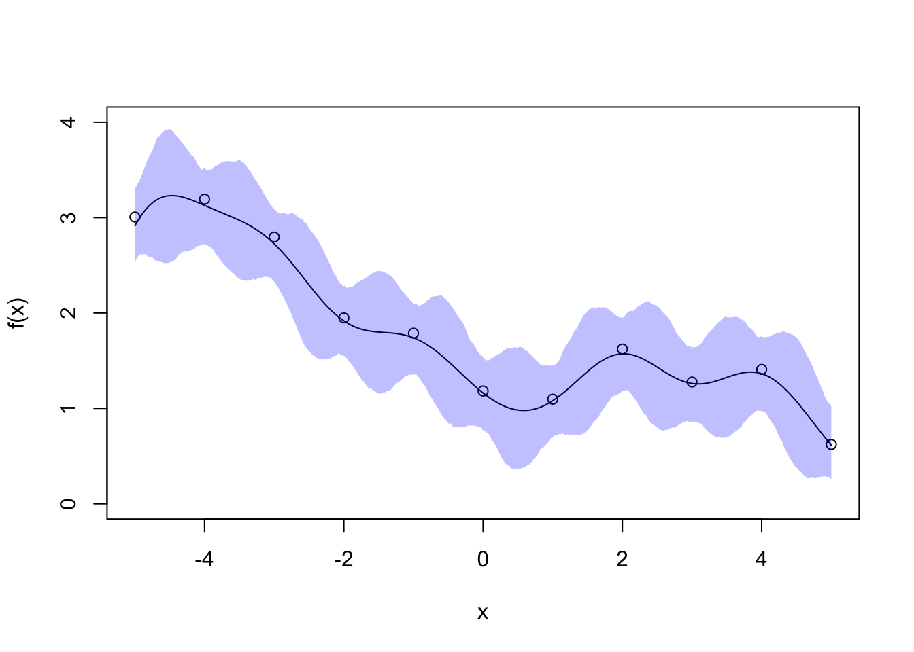


The posterior mean for $f$ is a smooth line passing near each point. The empirical 95\% credible interval for $f$ is thinnest in the vicinity of each data point (smaller variance for these grid points) and thickest in  the data gaps (larger variance). This nicely reflects our uncertainty about $f$ and you can imagine how the credivle intervals would shrink if we collect more data to fill the gaps.
:::

## Data Augmentation
Real world data are often messy with data points missing which may mean they are partially or completely unobserved. One common example of this is in clinical trials where people drop out of the trial before their treatment is complete. Another example is crime data, where only a fraction of crimes are reported and many crimes go unobserved. Two common ways to deal with partially or completely unobserved data are:

* Remove data points that are not completely observed. This throws away information and is likely to increase the overall uncertainty in the estimates due to the reduced sample size. 
* Replace data points that are not completely observed with some estimates. This process is known as Data imputation. If we simply treat the imputed data as observed, then we are likely to underestimate the uncertainty as we are treating the observation as completely observed when it is not. 

The Bayesian framework provides a natural way for dealing with missing, partially, or completely unobserved data using the technique called data augmentation. It allows us to infer the missing/hidden information alongside the model parameters. 

In data augmentation, we distinguish between two likelihood functions.

* The **observed data likelihood function** is the likelihood function of the observed data. 


* The **complete data likelihood function** is the likelihood function of the observed data and any unobserved data had they been fully observed. 

The difference between the two likelihood functions is that the complete data likelihood function is the function had we observed everything we want to observe. However, as the complete data likelihood function contains data we didn't fully observe, we can't compute it. Instead we can only evaluate the observed data likelihood function. 

Mathematically, we can write the complete data set $X = (X_1,\dotsc,X_n)$, with each $X_i = (Y_i, Z_i)$, where $Y_i$ denotes the observed information while $Z_i$ denotes the unobserved/missing information. If we assume all the $X_i$'s are independent, then the complete (data) likelihood function is $\pi(x \mid \theta) = \prod_{i=1}^n\pi(x_i\mid \theta) = \prod_{i=1}^n\pi(y_i,z_i\mid \theta)$. Let $Y = (Y_1,\dotsc,Y_n)$ denote the **observed data** in the complete data set $X$. The observed data likelihood function is instead $\pi(y\mid \theta) = \prod_{i=1}^n\pi(y_i\mid \theta) = \prod_{i=1}^n \int \pi(y_i,z_i\mid \theta) dz_i$. 

In data augmentation, we start off with the observed data likelihood function and then augment this function by introducing hidden (latent) variables which denotes the unobserved data. This then gives us the complete data likelihood function. Throughout the examples that we shall discuss below, we illustrate the point that it is often easier to work with the complete data likelihood in the presence of unobserved data, because it allows the use of Gibbs sampler for simultaneous Bayesian Inference on model parameters and the missing information. 


### Censored observations
The first example we will look at is when data is censored. Instead of throwing away these observations, we will instead treat them as random variables and infer their values. 

::: {.example}
A bank checks transactions for suspicious activities in batches of 1000. 
It checks five batches and observes $y_1, \ldots, y_4$ suspicious transactions in the first four batches. Due to a computer error, the number of suspicious transactions in the final batch is not properly recorded, but is known to be less than 6. It is reasonable to assume $Y_1,\dotsc,Y_5 \mid p \overset{i.i.d}\sim \text{Binomial}(1000,p)$, but we do not observe the exact value of $Y_5$.


The observed data likelihood functions is 
\begin{align*}
\pi(y_1, \ldots, y_4, y_5 < 6 \mid p) &=\sum_{y_5 = 0}^5 \pi(y_1,\dotsc,y_4,y_5 \mid p) = \sum_{y_5 = 0}^5 \left(\prod_{i=1}^5 \begin{pmatrix} 1000 \\ y_i \end{pmatrix} p^{y_i}(1-p)^{1000 - y_i} \right) \\ &= \left(\prod_{i=1}^4\begin{pmatrix} 1000 \\ y_i \end{pmatrix} p^{y_i}(1-p)^{1000 - y_i} \right)\left(\sum_{y_5=0}^5\begin{pmatrix} 1000 \\ y_5 \end{pmatrix} p^{y_5}(1-p)^{1000 - y_5}\right).
\end{align*}

 Placing a uniform prior distribution on $p \sim \text{Unif}[0, 1]$ gives the posterior distribution
$$
\pi(p \mid y_1, \ldots, y_4, y_5 <6) \propto \left( p^{\sum_{i=1}^4 y_i}(1-p)^{\sum_{i=1}^4y_i} \right)\left(\sum_{y_5=0}^5\begin{pmatrix} 1000 \\ y_5 \end{pmatrix} p^{y_5}(1-p)^{1000 - y_5}\right).
$$
Although we could sample from this distribution using Metropolis-Hastings algorithms, they do not produce any information regarding the censored data point $y_5$, which may be of interest itself. 

Instead, we can write down the complete data likelihood by assuming that the exact value of $y_5$ was observed: 
$$
\pi(y_1, \ldots, y_5 \mid p)  = \prod_{i=1}^5\begin{pmatrix} 1000 \\ y_i \end{pmatrix} p^{y_i}(1-p)^{1000 - y_i}.
$$
With the same uniform prior, the posterior distribution is 
$$
p \mid y_1, \ldots, y_5 \sim \hbox{Beta}\left(\sum_{i=1}^5 y_i + 1, 5000 + 1 - \sum_{i=1}^5 y_i\right).
$$

The conditional distribution of $Y_5\mid p, y_1, \dotsc,y_4$ can be computed using Bayes rule, with the additional constraint $Y_5 < 6$
$$
  \pi( y_5 \mid y_1, \ldots, y_4,y_5<6, p) = \frac{\pi(y_1,\dotsc,y_5\mid p)}{\pi(y_1,\dotsc,y_4, y_5 < 6\mid p)}=\frac{\begin{pmatrix} 1000 \\ y_5 \end{pmatrix} p^{y_5}(1-p)^{1000 - y_5}}{\sum_{j=0}^{5}\begin{pmatrix} 1000 \\ j \end{pmatrix} p^{j}(1-p)^{1000-j}}, 
$$
for $y_5 \in \{0,\dotsc,5\}$. With these two easy-to-sample conditional distributions identified, we can use a Gibbs sampler alternating between sampling $p$ and $y_5$. 
:::

### Latent Variables
Latent variable are variables that are cannot be observed, these may be hidden somehow or introduced to help with the modelling. 
Mixture model is a major example where latent variables are particularly useful. 

::: {.example}
Royal Mail use image detection software to read postcodes on letters. A camera scans the front of an envelope and then records the barcode. This example is a very simplified version of how the system could work.   

Suppose the machine is processing a bag of letters addressed to people in either B1 or B2 postcodes. The camera scans the first two characters of the postcode (B1 or B2) and records the proportion of the scanned image that is taken up by the characters. The picture below shows an example of what the scanned image looks like.

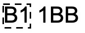<!-- -->

The scanned image is a 10 by 10 grid of pixels, where the number of pixels coloured black of the $i^{th}$ image is $Y_i\mid \theta \sim \hbox{Binomial}(100, \theta)$. However, $\theta$ depends on if the letter is going to B1 or B2. To allow for this, we introduce a latent variable $Z_i \in \{1,2\}$ that describes if the characters on the $i^{th}$ image are B1 or B2. In other words, one can think of $Z_i$ as 'membership' of $Y_i$ that we cannot observed. 

The observation $y_i$ is the number of pixels of the $i^{th}$ image that is coloured black. We observe $y_i$, but want to infer its membership $Z_i$. The difficultly is the lack of one-to-one correspondence between the values $y_i$ can take and the value $z_i$. Due to the different handwriting and fonts used on envelopes, if the letter is going to B1 ($Z_i = 1$), then $Y_i \mid Z_i = 1 \sim \hbox{Binomial}(100, \theta_1)$ and if it is going to B2 ($Z_i = 2$), then $Y_i \mid Z_i = 2 \sim \hbox{Binomial}(100, \theta_2)$.   The plot below shows the two densities and the overlap between them for $\theta_1 = 0.85$ and $\theta_2 = 0.9$.


```r
a <- 1:100
x <- dbinom(a, 100, 0.9)
y <-  dbinom(a, 100, 0.85)
plot(a, x, type = 'l', xlab = expression(y),
     ylab = "density", xlim = c(70, 100))
lines(a, y, lty = 2)
```

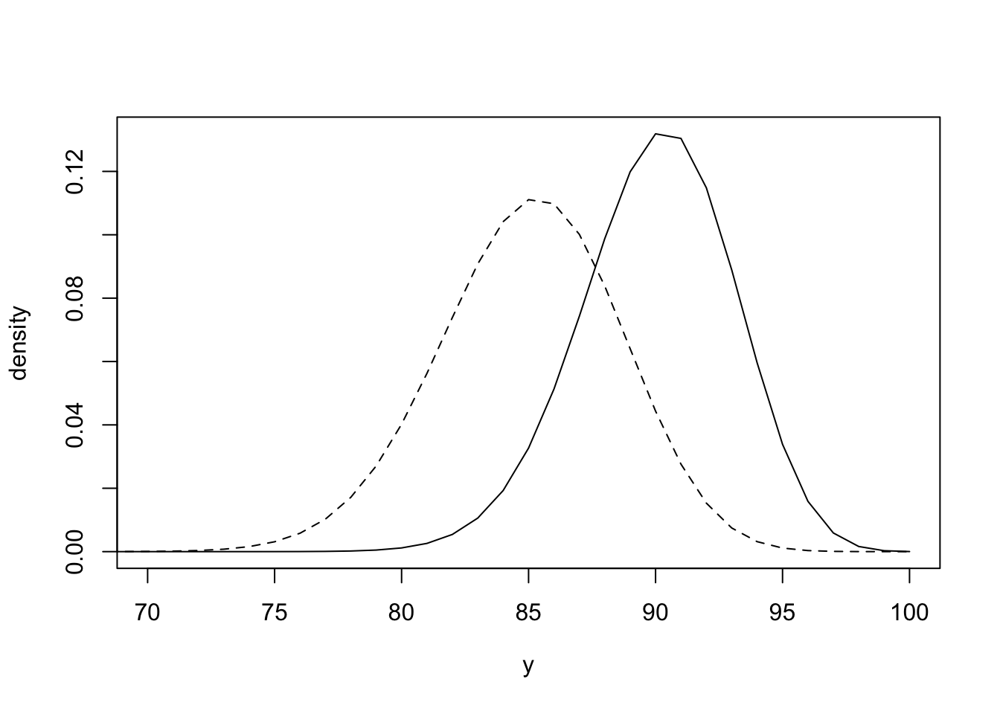

Suppose we have $X_i = \{Y_i,Z_i\}$ for $i = 1,\dotsc,N$, where the $Z_i$'s are latent variables that we do not observe. We assume $Z_i\mid p \overset{i.i.d.}\sim  2-\hbox{Bernoulli}(p)$, so that $\mathbb{P}(Z_i = 1\mid p) = p$ and $\mathbb{P}(Z_i = 2\mid p) = 1-p$, where the parameter $p$ describes how likely a letter is from B1 or B2. For each $i$, we have 
\begin{align*}
\pi(y_i\mid p, \theta_1,\theta_2) &= \pi(y_i\mid Z_i = 1)\mathbb{P}(Z_i = 1) +  \pi(y_i\mid Z_i = 2)\mathbb{P}(Z_i = 2) \\ &= p \,\pi(y_i\mid \theta_1)+(1-p)\,\pi(y_i\mid\theta_2)
\end{align*}

Let $\boldsymbol{Y} = (Y_1,\dotsc,Y_n)$ denote all the observed data and $\boldsymbol{Z} = (Z_1,\dotsc,Z_n)$ denote all the unobserved data (memberships). 
The observed data likelihood function is therefore 
\begin{align*}
\pi(\boldsymbol{y} \mid  p, \theta_1, \theta_2) &=\prod_{i=1}^N \bigg[ p\pi(y_i \mid \theta_1) + (1-p)\pi(y_i \mid \theta_2)\bigg] \\
&=\prod_{i=1}^N \bigg[p \begin{pmatrix} 100 \\ y_i \end{pmatrix} \theta_1^{y_i}(1-\theta_1)^{100 - y_i} + (1-p)\begin{pmatrix} 100 \\ y_i \end{pmatrix} \theta_2^{y_i}(1-\theta_2)^{100 - y_i}\bigg]
\end{align*}

Deriving full conditional distributions based on the above likelihood (even assuming uniform priors on $p,\theta_1,\theta_2$) is challenging due to the sum in the product of $N$ terms. 
Instead, it's easier to work with the complete data likelihood function, which is given by

\begin{align*}
\pi(\boldsymbol{y}, \boldsymbol{z} \mid  p, \theta_1, \theta_2) &=\prod_{i=1}^N \pi(y_i,z_i\mid p, \theta_1, \theta_2)=\prod_{i=1}^N \pi(y_i\mid z_i,p,\theta_1,\theta_2) \pi(z_i\mid p,\theta_1,\theta_2) \\ 
&= \prod_{i=1}^N \begin{pmatrix} 100 \\ y_i \end{pmatrix} \theta_{z_i}^{y_i}(1-\theta_{z_i})^{100 - y_i}\mathbb{P}(Z_i = z_i) \\
&= \prod_{i=1}^N \begin{pmatrix} 100 \\ y_i \end{pmatrix} (\theta_{1}^{y_i}(1-\theta_{1})^{100 - y_i}p)^{\mathbf{1}_{\{z_i = 1\}}}(\theta_{2}^{y_i}(1-\theta_{2})^{100 - y_i}(1-p))^{\mathbf{1}_{\{z_i = 2\}}} 
\end{align*}
\[ \small
= \bigg[\prod_{i=1}^N \begin{pmatrix} 100 \\ y_i \end{pmatrix}\bigg] \bigg[\theta_{1}^{\sum_{i:z_i = 1}y_i}(1-\theta_{1})^{\sum_{i:z_i = 1}(100 -y_i)}p^{\sum_{i=1}^N \mathbf{1}_{\{z_i = 1\}}}\bigg] \bigg[\theta_{2}^{\sum_{i:z_i = 2}y_i}(1-\theta_{2})^{ \sum_{i:z_i = 2}(100 -y_i)}(1-p)^{\sum_{i=1}^N \mathbf{1}_{\{z_i = 2\}}}\bigg].
\]
This form, although looks complicated, is actually much easier to derive the full conditional distributions. By Bayes' theorem, the posterior distribution is
$$
\pi(\boldsymbol{z}, p, \theta_1, \theta_2 \mid \boldsymbol{y}) \propto \pi(\boldsymbol{y},  \boldsymbol{z} \mid p, \theta_1, \theta_2) \pi(p)\pi(\theta_1)\pi(\theta_2), 
$$
where we put some independent prior distributions on $p, \theta_1,\theta_2$. 
Suppose we are ignorant about the value of $p$ and place a uniform prior distribution on the parameter $p$. The full conditional distribution is 
\begin{align*}
\pi(p\mid \boldsymbol{z}, \boldsymbol{y}, \theta_1, \theta_2) &\propto \pi(p,\boldsymbol{z}, \boldsymbol{y}, \theta_1, \theta_2) = \pi(\boldsymbol{y},  \boldsymbol{z} \mid p, \theta_1, \theta_2) \pi(p)\pi(\theta_1)\pi(\theta_2) 
\end{align*}
Hence, we just need to collect the terms that depend on $p$ from the complete data likelihood, and we obtain 
\[
\pi(p\mid \boldsymbol{z}, \boldsymbol{y}, \theta_1, \theta_2) \propto p^{N_1}(1-p)^{N_2}
\]
where $N_1 = \sum_{i=1}^N \mathbf{1}_{\{z_i = 1\}}$ and $N_2 = N - N_1 = \sum_{i=1}^N \mathbf{1}_{\{z_i = 2\}}$, which implies
$$
p \mid \boldsymbol{z} \sim \hbox{Beta}(N_1 + 1, N_2 + 1).
$$
Note that we drop other variables as the distribution only depends on $\boldsymbol{z}$. 

If we use Beta($\alpha_1, \beta_1$) as our prior distribution on $\theta_1$, the full conditional distribution of $\theta_1$ is
\begin{align*}
\pi(\theta_1 \mid \boldsymbol{z}, \boldsymbol{y}, \theta_2, p) \propto \pi(\boldsymbol{y},  \boldsymbol{z} \mid p, \theta_1, \theta_2) \pi(\theta_1)  
&\propto \theta_1^{\sum_{i; z_i = 1}y_i}(1-\theta_1)^{ \sum_{i; z_i = 1}(100-y_i)}\theta_1^{\alpha_1 - 1}(1-\theta_1)^{\beta_1 - 1} \\
&= \theta_1^{\sum_{i; z_i = 1}y_i + \alpha_1 -1 }(1-\theta_1)^{\beta_1 + \sum_{i; z_i = 1}(100-y_i) - 1}
\end{align*}
Hence $\theta_1 \mid \boldsymbol{z}, \boldsymbol{y} \sim \hbox{Beta}(\sum_{i; z_i = 1}y_i + \alpha_1 , 100N_1 + \beta_1 - \sum_{i; z_i = 1}y_i)$. Similarly,  $\theta_2 \mid \boldsymbol{z}, \boldsymbol{y} \sim \hbox{Beta}(\sum_{i; z_i = 2}y_i + \alpha_2 , 100N_2 + \beta_2 - \sum_{i; z_i = 2}y_i)$ under the prior $\theta_2 \sim \hbox{Beta}(\alpha_2,\beta_2)$. 

Finally, we look at the conditional distribution of each $Z_i$ given the remaining hidden variables $\boldsymbol{z}_{-i}$, the parameters $p$, $\theta_1$ and $\theta_2$, and the observations $\boldsymbol{y}$. Similar to the previous derivation, we have 
\begin{align*}
\mathbb{P}(Z_i = 1 \mid \boldsymbol{z}_{-i},\boldsymbol{y}, \theta_2, p,\theta_1) \propto p\theta_1^{y_i}(1-\theta_1)^{100-y_i}
\end{align*}
Similarly, 
\begin{align*}
\mathbb{P}(Z_i = 2 \mid \boldsymbol{z}_{-i},\boldsymbol{y}, \theta_2, p,\theta_1) \propto \theta_2^{y_i}(1-\theta_2)^{100-y_i}(1-p).
\end{align*}
Since $Z_i$ can only take two values, 1 or 2, we must have 
\[
p^*_i = \mathbb{P}(Z_i = 1 \mid \boldsymbol{z}_{-i},\boldsymbol{y}, \theta_2, p,\theta_1) = \frac{p\theta_1^{y_i}(1-\theta_1)^{100-y_i}}{p\theta_1^{y_i}(1-\theta_1)^{100-y_i}+\theta_2^{y_i}(1-\theta_2)^{100-y_i}(1-p)}
\]
and 
\[
\mathbb{P}(Z_i = 2 \mid \boldsymbol{z}_{-i},\boldsymbol{y}, \theta_2, p,\theta_1) = \frac{\theta_2^{y_i}(1-\theta_2)^{100-y_i}(1-p)}{p\theta_1^{y_i}(1-\theta_1)^{100-y_i}+\theta_2^{y_i}(1-\theta_2)^{100-y_i}(1-p)}
\]
Therefore, therefore $Z_i \mid \boldsymbol{y}, p,\theta_1,\theta_2 \sim 2-\hbox{Bernoulli}(p^*_i)$.

An MCMC algorithm for this would repeat the following steps:

1. Initialise values for $p, \theta_1, \theta_2$ and $\boldsymbol{z}$ 
2. Sample $p \mid \boldsymbol{z} \sim \hbox{Beta}(N_1 + 1, N_2 + 1)$.
3. Sample $\theta_1 \mid \boldsymbol{z}, \boldsymbol{y}  \sim\hbox{Beta}(\sum_{i; z_i = 1}y_i + \alpha_1 , 100N_1 + \beta_1 - \sum_{i; z_i = 1}y_i)$.
4. Sample $\theta_2 \mid \boldsymbol{z}, \boldsymbol{y} \sim \hbox{Beta}(\sum_{i; z_i = 2}y_i + \alpha_2 , 100N_2 + \beta_2 - \sum_{i; z_i = 2}y_i)$. 
5. Sample $Z_i \mid \boldsymbol{y}, p,\theta_1,\theta_2 \sim 2-\hbox{Bernoulli}(p^*_i)$ for each $i$.
6. Repeat Steps 2-5.

This algorithm may be slow to converge and explore the posterior distribution. This is because it has many parameters. There are 3 model parameters ($p$, $\beta_1$ and $\beta_2$) and $N$ latent variables. Exploring a posterior distribution with this many dimensions may take a lot of time and more efficient alternatives may be required.  
:::

### Grouped Data
Often, we can only receive data in grouped form. This is often the case in medical and crime settings, where patients are grouped together to protect their identity. Grouping data introduces a difficulty when trying to perform inference. Augmenting the data, by introducing parameters to represent different parts of the group can both simplify the inference workflow and provide more information than is possible otherwise. 

::: {.example}
Suppose that we have data on the number of treatment sessions required by a random sample of patients before they recover from a disease. For identifiability reasons, the numbers of patients requiring two or fewer treatment sessions are grouped and we obtain the following table

|Number of sessions $x$   |  $\leq 2$ | 3  |  4 | 5  | 6 |
|---|---|---|---|---|---|
| Frequency $f_x$  |25   |  7 | 4  |  3  | 1|

We are interested the the probability the treatment sessions are a success, assuming each session succeed independently. 

We can model the number of sessions required for each person using the geometric distribution, which has probability mass function 
\[
\mathbb{P}(X = x) = (1-p)^{x-1}p, \qquad x = 1,2,3,\dotsc
\]
if $X \sim \hbox{Geometric}(p)$. For each group of patients,  we can work out their contribution to the observed likelihood function using a geometric distribution.  For example, the contribution to the likelihood function for patients who had three treatment sessions is $((1-p)^2p)^7$. Since 
\[
\mathbb{P}(X \leq 2) = \mathbb{P}(X=1)+\mathbb{P}(X=2) = p+(1-p)p=(2-p)p,
\]
the group that had two or fewer sessions contributes to the likelihood contribution by $(p(2-p))^{25}$. 

The observed likelihood function is therefore
\begin{align*}
\pi(f_{1, 2}, f_3, \ldots, f_6 \mid p) &= [p(2-p)]^{25}\cdot [(1-p)^2p]^7\cdot [(1-p)^3p]^4 \cdot [(1-p)^4p]^3 \cdot (1-p)^5p.
\\
&= (p(2-p))^{25}(1-p)^{43}p^{15} \\
&= p^{40}(1-p)^{43}(2-p)^{25}
\end{align*}
There is no conjugate prior distribution that induces conjugacy. We use the prior distribution $p \sim \hbox{Beta}(\alpha, \beta)$. By Bayes' theorem, the posterior distribution is
$$
\pi(p \mid f_{1, 2}, f_3, \ldots, f_6 ) \propto p^{40 + \alpha - 1}(1-p)^{43 + \beta - 1}(2-p)^{25}.
$$

We can use a Metropolis-Hasting algorithm to sample from this algorithm. A suitable algorithm would look like this

1. Initialize $p^{(0)}$ and set $i = 0$. 
2. Propose $p' \sim U[p^{(i)} + \varepsilon, p^{(i)} - \varepsilon]$. 
3. Accept $p^{(i+1)}=p'$ with probability $p_{acc}$, otherwise reject as set $p^{(i+1)}=p^{(i)}$.
4. Set $i=i+1$ and repeat steps 2-3. 

The acceptance probability in step 3 is given by
$$
p_{\textrm{acc}} = \min\left\{\frac{(p')^{40 + \alpha - 1}(1-p')^{43 + \beta - 1}(2-p')^{25}}{p^{40 + \alpha - 1}(1-p)^{43 + \beta - 1}(2-p)^{25}} ,1\right\}.
$$
Instead of using the observed data likelihood, we can write the complete data likelihood supposing we had seen the number of patients who had had one and two sessions. The complete data likelihood function is
\begin{align*}
\pi(f_1 \ldots, f_6 \mid p) &= p^{f_1}\cdot [(1-p)p]^{f_2} \cdot [(1-p)^2p]^7\cdot [(1-p)^3p]^4 \cdot [(1-p)^4p]^3 \cdot (1-p)^5p.
\\&= p^{40}(1-p)^{f_2 + 43}, 
\end{align*}
where $f_2$ is the unobserved variable. Now, consider Beta($\alpha, \beta)$ as the prior distribution on $p$. We have
$$
p \mid f_1 \ldots, f_6  \sim \hbox{Beta}\left(40 + \alpha, f_2+43 + \beta\right).
$$
In order to implement Gibbs sampler, we just need to find $\pi( f_2 \mid f_3 \ldots, f_6,p)$. Note that $f_1$ is not considered as an unknown variable since $f_1 = 25-f_2$ and once we know $f_2$, we would know $f_1$.

Under the geometric distribution model, the probability a patient recovers after exactly one session is $p$ and after two sessions is $(1-p)p$. Moreover, $\mathbb{P}(X = 2\mid X\leq 2) = \frac{(1-p)p}{p+(1-p)p} = \frac{1-p}{2-p}$, for $X\sim \hbox{Geometric}(p)$. We can therefore model $f_2$ as a Binomial distribution 
\[
f_2 \mid p\sim \hbox{Binomial}(25,q),
\]
where 
$$
q = \frac{1-p}{2-p}.
$$
Our Gibbs sampler could be

1. Initialise $p$ and  $f_2$.  
2. Sample $p \mid  f_2  \sim \hbox{Beta}(40 + \alpha, f_2 + 43 + \beta)$
3. Sample $f_2 \mid p \sim \hbox{Binomial}(25,q)$ with $q = \frac{1-p}{2-p}.$
4. Repeat steps 2 - 3. 

This Gibbs sampler avoids any tuning or accept/reject steps in MH sampler, making it potentially more efficient.
:::


## Prior Ellicitation (Optional reading)
Throughout this course, we have tried to be objective in our choice of prior distributions. We have discussed **uninformative** and **invariant** prior distributions. Sometimes we have used **vague** prior distributions, such as the Exp(0.01) distribution. And other times, we have left the parameters as generic values. This misses out on one real difference between Bayesian and frequentist inference. In Bayesian inference, we can include prior information about the model parameters. Determining the value of prior parameters is know as prior elicitation. This is more of an art than a science and still controversial in the Bayesian world. In this section, we are going to look at a few ways of how to elicit prior information from experts. 

:::{.example}
This example to show how difficult it is to talk to experts in other areas about probabilities and risk. Suppose we are interested in estimating the number of crashes on a new motorway that is being designed. Denote the number of crashes per week by $X$ and suppose $X \sim \hbox{Po}(\lambda)$. We place a $\lambda \sim \Gamma(\alpha, \beta)$ prior distribution on the rate parameter $\lambda$. The density function of this prior distribution is 
$$
\pi(\lambda) = \frac{\beta^\alpha}{\Gamma(\alpha)}\lambda^{\alpha-1}\exp(-\lambda\beta). 
$$
The parameter $\alpha$ is know as the shape parameter and $\beta$ the rate parameter. 

We interview road traffic police, highway engineers and driving experts to estimate the values of $\alpha$ and $\beta$. The difficulty is that they do not know about the Gamma distribution or what shape and rate parameters are. Instead, we can ask them about summaries of the data. For the Gamma distribution, the mean is $\alpha/\beta$, the mode is $(\alpha - 1)/\beta$ and the variance is $\alpha/\beta^2$. If we can get information about two of these then we can solve for $\alpha$ and $\beta$. But needing two brings about another difficulty, non-mathematicians have limited understanding of statistics and probability. They can find it difficult to differentiate between the mean and the mode, and the concept of variance is very difficult to explain. 
:::

### Prior Summaries
The first method we are going to look at is called summary matching. For this method, we ask experts to provide summaries of what they think the prior distribution is. We then choose a function form for the prior distribution and use these summaries to estimate the prior distribution. The choice of summaries depend on the application in hand as well as the choice of prior distribution. Common choices are: the mean, median, mode, variance, and cumulative probabilities (i.e. $\pi(\theta < 0.5)$). 

:::{.example}
Let's return to the motorway example from above. Suppose that a highway engineer tells us the expected number of crashes per week is 0.75 and the probability that $\lambda < 0.9$ is 80\%. Matching summaries tells us
$$
\frac{\alpha}{\beta} = 0.75 \\
\int_0^{0.9}\pi(\lambda) d\lambda = 0.8
$$

From the expectation, we have $\alpha = 0.75\beta$. To estimate the value of $\beta$ from the cumulative probability, we need to find the root to the equation 
$$
\int_0^{0.9} \frac{\beta^{0.75\beta}}{\Gamma(\beta)}\lambda^{0.75\beta-1}e^{-\lambda\beta}d\lambda - 0.8 = 0. 
$$

This looks horrible, but there are many optimisation ways to solve this problem. 


```r
cummulative.eqn <- function(b){
  #Compute equation with value beta = b
  value <- pgamma(0.9, 0.75*b, b)-0.8
  return(value)
  
}

uniroot(cummulative.eqn, lower = 1, upper = 1000)
```

```
## $root
## [1] 21.80224
## 
## $f.root
## [1] -5.747051e-08
## 
## $iter
## [1] 8
## 
## $init.it
## [1] NA
## 
## $estim.prec
## [1] 6.103516e-05
```
This gives us $\beta = 21.8$ and $\alpha = 13.65$. 
:::

### Betting with Histograms
The difficulty with the summary matching method is that it requires experts to describe probabilities about the prior parameter, which is difficult to do and quite an abstract concept. Instead of asking them to describe summaries, we can ask them to draw the prior distribution completely,  using a betting framework. 

In the **prior weights** (sometimes called roulette) method, we give the the experts a set of intervals for the parameter of interest and fixed number of coins. We then ask the experts to place the coins in the intervals according to how likely they think the parameter will be in each interval, effectively betting on what value the parameter will take. For example, they might place $n_1$ coins in the interval $\theta \in [a, b)$, $n_2$ in $\theta \in [b, c)$ and $n_3$ for $\theta \in [c, d]$. From this we can construct our prior density. 


:::{.example}
Suppose we are interested in the probability a pharmaceutical drug has the desired clinical effect. The outcome of each patient's treatment can be modelled by $X\sim\hbox{Bernoulli}(p)$. We ask a clinical about their experience with patients and similar treatments. We ask the expert to estimate the probability of successful treatment by betting on the value for $p$ using the following table and 20 coins. 


| $p$        | Coins |
|------------|-------|
| [0, 0.2)   | 3     |
| [0.2, 0.4) | 7     |
| [0.4, 0.6) | 5     |
| [0.6, 0.8) | 3     |
| [0.8, 1]   | 2     |


We can use the website http://optics.eee.nottingham.ac.uk/match/uncertainty.php# to fit a distribution to this table. It proposes the best fit of a $p \sim \Gamma(3.10, 6.89)$. We can use this distribution as the prior distribution, although it is not conjugate and places weight on $p > 1$. Another option is a Beta$(1.64, 2.16)$ distribution, 
:::

### Prior Intervals
The last method we will look at is the **bisection** method. In this method, we ask the experts to propose four intervals, each of which the parameter value is likely to fall into, i.e. $\pi(\theta \in [a, b)) = \pi(\theta \in [c, d)) = \pi(\theta \in [e, f))= \pi(\theta \in [g, h)) = 0.25$. From these intervals, we develop a prior distribution that fits these intervals. 

:::{.example}
The police are interested in estimating the number of matching features between a fingerprint from a crime scene and a fingerprint from a suspect in the police station. The number of matching features is $X \sim \hbox{Po}(\lambda)$. We speak to experienced fingerprint analysts. She advises us that about a quarter of the time, she would expect to see between 0 and 4 matches and this is when it is unlikely for the suspect to be the criminal. She says in some cases, it's very clear that the suspect is the criminal as she would expect to see 20 to 30 matches.  The rest of the time, she sees some matches but the fingerprint collected at the crime scene is poor quality, so see may see 5 to 14 matches. She agrees that the matches are uniform across this range. So our four intervals are [0, 4], [5, 12], [13, 19], [20, 30]. Using the Match software, we get a Uniform[0, 30] distribution. 
:::

## Lab

### Gaussian Processes

:::{.example}
The code below shows how to set up a Gaussian Process and draw samples from it in R. 

```r
require(MASS)
```

```
## Loading required package: MASS
```

```r
squared.exponential.covariance <- function(x1, x2, alpha, ell) {
  #Squared Exponential Covariance Function
  #Inputs: x1, x2 -- vectors, alpha, ell -- variance and length scale parameter
  pairwise_distances <- outer(x1, x2, "-")
  covariance_matrix <- alpha * exp(-0.5 * (pairwise_distances / ell)^2)
  return(covariance_matrix)
}

#Set up GP
x <- seq(0, 5, 0.01)
mu <- rep(0, length(x))
Sigma <- squared.exponential.covariance(x, x, 1, 1)

#Generate Samples and Summaries
f <- MASS::mvrnorm(1000, mu, Sigma)
f.mean <- apply(f, 2, mean) #GP mean
f.95.upper <- apply(f, 2, quantile, 0.975)
f.95.lower <- apply(f, 2, quantile, 0.025)

#Generate some plots
plot(x, f[1, ], type = 'l', ylim = c(min(f[1:3, ]), max(f[1:3, ])))
lines(x, f[2, ], col = 2)
lines(x, f[3, ], col = 3)
```

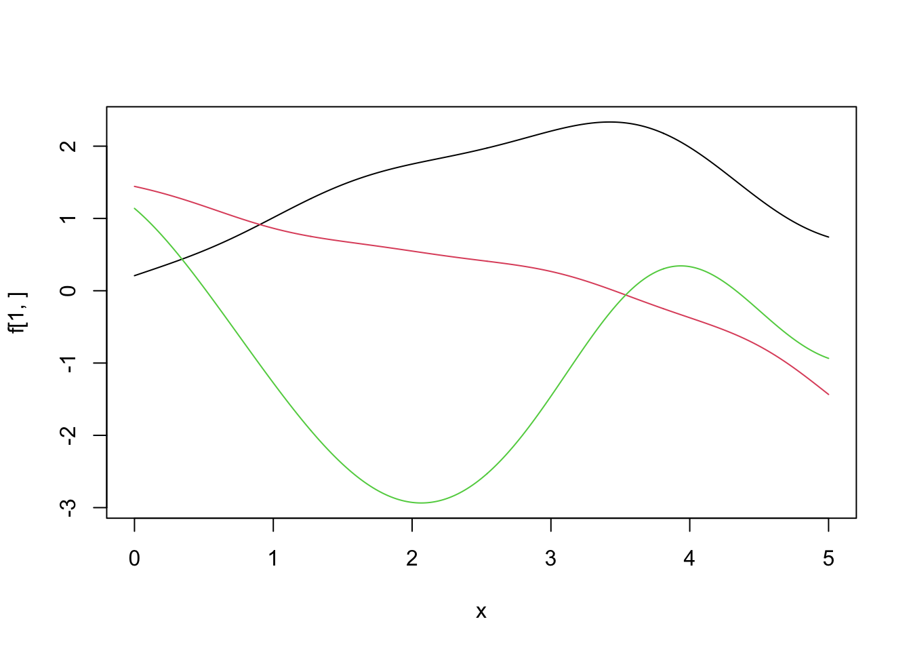

```r
plot(x, f.mean, type = 'l', ylim = c(-5, 5)) #0 -- no surprise there
polygon(c(x, rev(x)), c(f.95.lower, rev(f.95.upper)), col = rgb(0, 0, 1, 0.25))
```

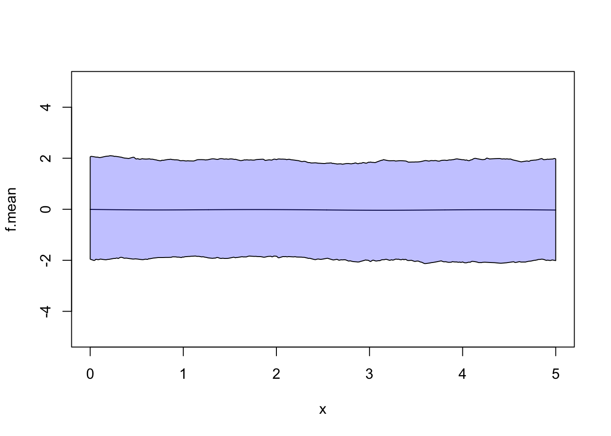

:::

:::{.exercise}
Code up example 6.1. How does your choice of length scale affect the posterior distribution. You can use 

```r
x <- -5:5
y <-  c(3.0942822, 3.0727920, 2.6137341, 1.8818820, 1.2746738, 1.2532116, 1.4620830, 1.4194647, 1.6786969, 1.1057042, 0.4118125)
```
with $\sigma^2 = 0.2$.To draw samples from the multivariate normal distribution with mean vector $\boldsymbol{\mu}$ and covariance matrix $\Sigma$ use the MASS package. 
:::


:::{.exercise}
Repeat Exercise 6.1, but this time set the fine grid to be $\boldsymbol{x}^* = \{-5, -4.9, -4.8, \ldots, 9.8, 9.9, 10\}$. What happens to the posterior distribution after $x^* = 5$?
:::


::: {.exercise}
You observe the following data 

```r
x <- -5:5
y <- cos(0.5*x) + log(x + 6)
y
```

```
##  [1] -0.8011436  0.2770003  1.1693495  1.9265967  2.4870205  2.7917595
##  [7]  2.8234927  2.6197438  2.2679618  1.8864383  1.5967517
```

```r
plot(x, y, xlab = "x", ylab = "f(x)", ylim = c(0, 4))
```

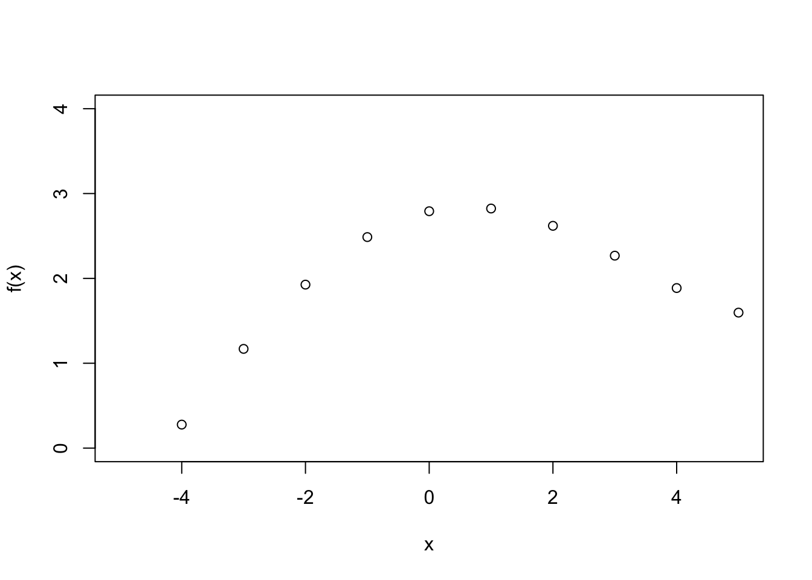

Fit a function to the data using a GP prior distribution. Note that this time there is no noise. 
:::

### Censored Data

:::{.exercise}
In Example 6.2, suppose the observed data is $\{y_1, y_2, y_3, y_4\} = \{4, 4, 5 ,2\}$. Design and code an MCMC algorithm to generate samples from the posterior distribution for $p$ and $y_5$. 
:::

:::{.exercise}
Suppose you manage a clinical trial. You administer a new drug to patients and record how many days until their symptoms are alleviated. You observe the times for the first 9 patients

```r
x <- c(33.5,  17.8, 218.2,   3,  39.2,   3.5,  43.7,  14.6,  20)
```
Patient 10 drops out of the trial on day 50 and at this point, their symptoms have not changed. They send an email on day 200 to say they no longer have any symptoms, i.e. $x_{10} \in (50, 200]$. Write down a model for this problem and derive the posterior distribution given a prior that you may choose. Design and code an MCMC algorithm to generate samples from the posterior distribution for any model parameters that you introduce and the censored observation $x_{10}$. 
:::


